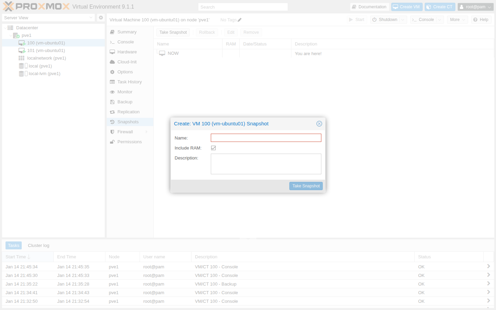
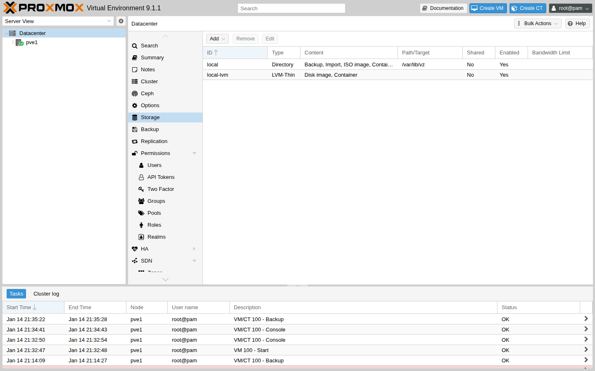
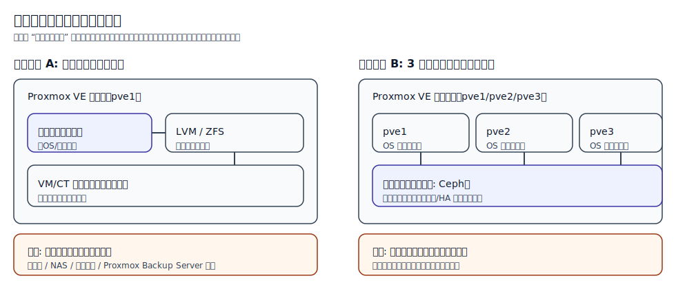
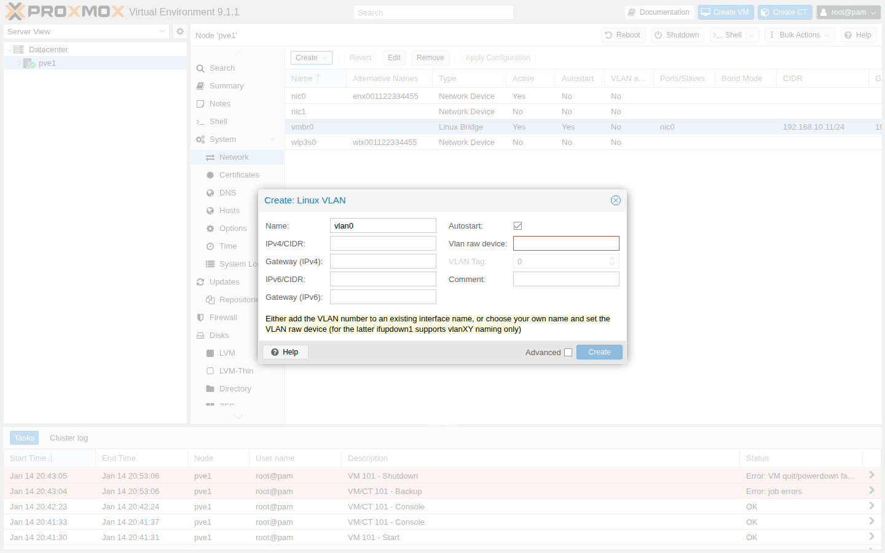
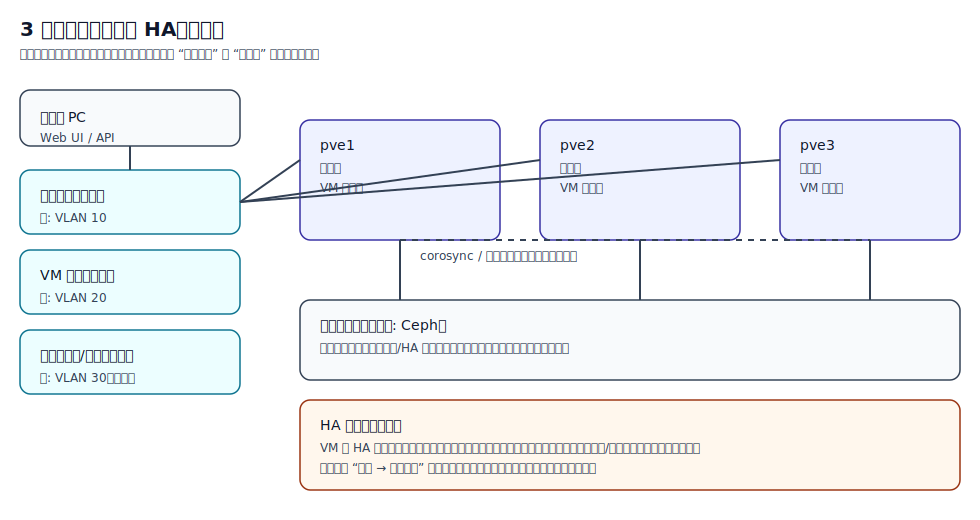
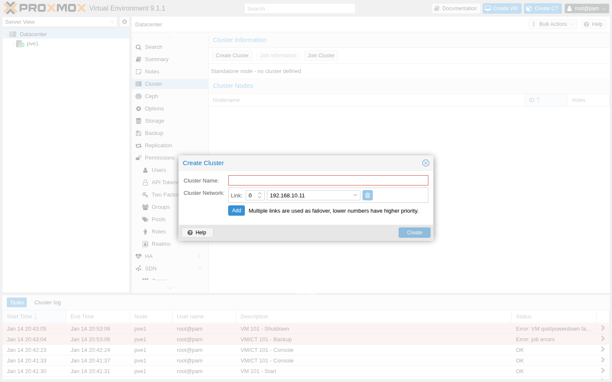
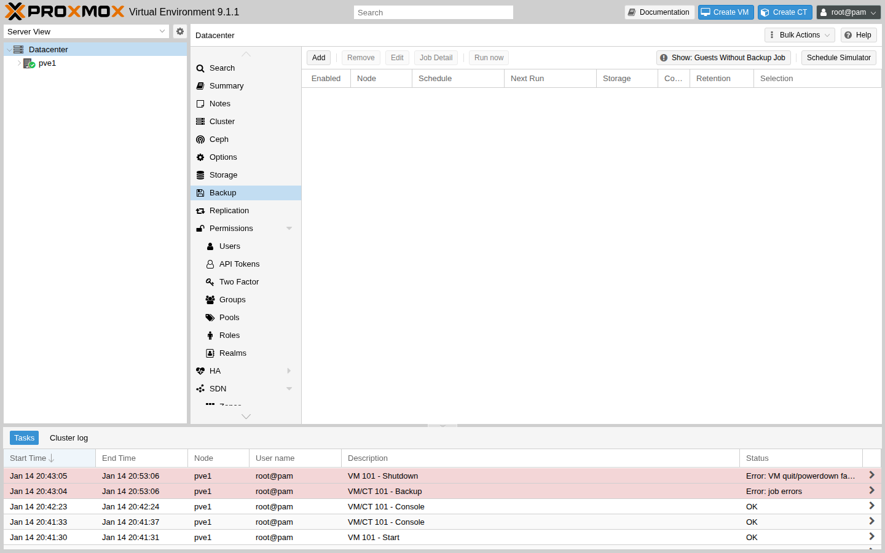

# 序章　本書の目的と読み方

## 本書の目的

本書は、Proxmox VE をこれから本格的に活用したいインフラエンジニアやシステムインテグレータに向けて、
実務で役に立つ知識と設計・運用の考え方を体系的に整理したものです。
単なる機能紹介ではなく、「なぜその設計にするのか」「どのような運用体制を前提にしているのか」をできるだけ言語化し、
読者が自分の現場に持ち帰って応用できることを目標とします。

また、Proxmox VE をまだ採用していない読者に対しても、
既存の仮想化基盤やクラウドサービスとの違い・組み合わせ方を理解するための材料を提供し、
新しい選択肢を検討する際の参考情報となることを目指します。

## 想定読者と前提知識

本書の主な読者像は次の通りです。

- これから Proxmox VE を評価・導入しようとしているインフラエンジニア
- 中小規模〜中堅規模のシステムインテグレータに所属し、オンプレミス環境の提案・構築を担当している技術者
- 既存の仮想化基盤（vSphere など）からの移行・並行運用を検討している技術リーダー

前提となる知識レベルは、概ね次のように想定しています。

- Linux サーバの基本的な操作（パッケージ管理、ログ確認、ネットワーク設定など）
- 仮想化の基本概念（ハイパーバイザ、仮想マシン、スナップショットなど）
- TCP/IP ネットワークの基礎（IP アドレス、ルーティング、VLAN の概要）

これらに不安がある場合でも、各章では重要な概念を簡単におさらいしながら説明します。
必要に応じて、外部ドキュメントや付録への参照も示します。

## 対象バージョンと表記

本書のスクリーンショットと UI 手順は、原則として **Proxmox VE 9.1（9.x 系）** を前提にしています。
Proxmox VE は定期的にアップデートされるため、マイナーバージョンの差で UI の位置や文言が変わることがあります。
その場合は、本書の「画面の開き方（どこをクリックするか）」を手がかりに読み替えてください。

また、本文中のホスト名・IP アドレス・ユーザー名などは説明のための例です。
読者の環境に合わせて置き換えて進めてください。

補足:

- インストールメディア（ISO）の最新版やリリース情報は、公式のダウンロード案内で確認してください（例: `https://pve.proxmox.com/wiki/Downloads`）。
- インストール直後に更新を適用している場合、同じ 9.1 系でもパッチ番号（例: 9.1.1）の差で表示や項目が変わることがあります。手元の環境のバージョンは `pveversion -v` で確認できます。

## 本書の構成

本書は大きく次のパートで構成されます。
詳細な章構成は `manuscript/ja/SUMMARY.md` にまとめられており、ここではその概要を示します。

- Part 0: 序章と執筆・検証環境の準備  
  本章（序章）で本書全体の目的と読み方を説明し、続く章でラボ環境の前提や検証用セットアップを整理します。
- Part I: Proxmox VE の概要と基本操作  
  Proxmox VE の位置づけとアーキテクチャを紹介し、インストール手順と仮想マシンの基本操作を一通り体験します。
- Part II: ストレージとネットワーク設計  
  ZFS や LVM、Ceph などのストレージ選択肢と、ブリッジ・ボンディング・VLAN を含むネットワーク設計を扱います。
- Part III: クラスタリング・HA・バックアップ  
  複数ノードによるクラスタ構成、高可用性 (HA)、バックアップとレプリケーションを組み合わせた保護戦略を解説します。
- Part IV: 運用・監視・エンタープライズ連携  
  日常運用や監視、トラブルシュートの考え方に加え、エンタープライズ環境との連携や設計パターンをまとめます。

各章の詳細なタイトルや順番は、今後の改訂や構成変更に応じて `SUMMARY.md` とともに見直される可能性があります。
その場合は、本章の記述も合わせて更新します。

## 学習の進め方

本書は、個人学習とチームでの学習のどちらにも利用できるように構成されています。

### 個人学習として読む場合

- Part 0 でラボ環境の前提を確認し、自分の PC や検証用サーバで再現できる範囲を決めます。
- Part I を通読し、まずは単一ノードの Proxmox VE をインストールして仮想マシンを操作できるようになることを目標とします。
- その後、自身の関心や業務に近いテーマ（ストレージ／ネットワーク／クラスタ／バックアップなど）から順に読み進めて構いません。
- 細かな設定値は暗記するのではなく、「なぜこの選択をしているのか」を意識しながら読み進めると、設計への応用がしやすくなります。

### チーム学習・社内勉強会で使う場合

- まず本章と Part 0・Part I をチームで共有し、本書が前提としているラボ環境や運用イメージを合わせます。
- 各メンバーに担当パートを割り振り、実際にラボ環境で手を動かしながら内容を確認します。
- 社内の標準や制約（利用できるストレージ、ネットワーク機器、監視基盤など）を書き出し、
  各章の内容を自社向けにどうアレンジするかを議論する材料として使ってください。

## Proxmox VE の位置づけ（簡単な概要）

Proxmox VE は、オープンソースの仮想化基盤として、KVM ベースの仮想マシンと LXC コンテナ、ストレージやネットワークの管理を一体的に提供するプラットフォームです。
Web ベースの管理 UI と API を備え、比較的少ない台数からクラスタ構成までスケールできるのが特徴です。

一般に、既存の商用ハイパーバイザ製品と比較すると、ライセンス体系や運用モデルが異なります。
本書では、特定ベンダー製品との詳しい比較は行いませんが、
「小規模〜中規模のオンプレミス環境で、どのような場面で Proxmox VE が有力な選択肢となり得るか」
という観点で、各章の解説の中に位置づけを織り込んでいきます。

以降の章では、ここで述べた目的と読み方を前提に、具体的なセットアップ手順や設計パターンを順番に掘り下げていきます。

## ミニ演習（手を動かす）

- [ ] 本書を「どこまでやるか」を決める（単一ノードまで / 3ノードクラスタまで / 特定パートだけ、など）
- [ ] `manuscript/ja/SUMMARY.md` を開き、読む順番（章）とゴールを書き出す
- [ ] 自分のラボ環境の前提（例: `pve1` のIP、DNS/NTP、バックアップ退避先）をメモに固定する

## まとめ

- 本書は、Proxmox VE を実務で活用するための「設計・運用の考え方」を重視して整理する。
- 想定読者・前提知識・対象バージョン（9.1 / 9.x）を把握し、自分の環境に読み替えて進める。
- 全体の構成（Part 0〜IV）と学習の進め方（個人学習/チーム学習）を確認し、読み進める順番を決める。

次は、第0章「執筆環境・検証環境の準備」でラボ構成の前提を整理します。
# 執筆環境・検証環境の準備

本章では、本書の内容を実際に手を動かしながら追いかけるための環境づくりについて説明します。
読者が用意できるハードウェアや既存の仮想化基盤はさまざまですが、
ここでは「最低限この程度あれば本書の演習を一通り試せる」という目安と、
より踏み込んだ検証やクラスタ構成まで試したい場合の推奨構成を示します。

## 章のゴール

この章では、読者が自分の状況（手元PC・サーバ台数・既存の仮想化基盤）に合わせて、
本書のハンズオンを進めるための最小限のラボ構成を決められるようになることを目標とします。

## この章で分かること / 分からないこと

- 分かること:
  - 本書が前提とする Proxmox VE のバージョン
  - 単一ノード/3ノードクラスタ（ネスト可）のラボ構成パターン
  - 検証環境で事前に決めておくべき項目（命名、IP、DNS/NTP など）
- 分からないこと（後続章で扱います）:
  - インストーラの画面操作（第3章）
  - VM 作成やバックアップなど、Proxmox VE の具体的な操作手順（第4章以降）

## 対象バージョン（Proxmox VE 9.1）

本書のスクリーンショットと UI 手順は、原則として **Proxmox VE 9.1（9.x 系）** を前提にしています。
Proxmox VE 9.x は Debian 13（Trixie）をベースとしており、OS の基本的な操作感は Debian 系 Linux と共通です。

最新版の ISO とリリース情報は、公式のダウンロード案内で確認してください（例: `https://pve.proxmox.com/wiki/Downloads`）。
また、インストール直後に更新を適用している場合、同じ 9.1 系でもパッチ番号（例: 9.1.1）の差で表示や項目が変わることがあります。

ただし、カーネル（例: 6.14 系 / 6.17 系）や UI はマイナー更新で変わることがあります。
読者の環境での「いまの状態」は次のコマンドで確認できます。

- Proxmox VE のバージョン確認: `pveversion -v`
- カーネル確認: `uname -r`

注意: Proxmox VE のバージョンアップでは、カーネル更新に伴ってドライバやカーネルモジュールの互換性問題が出ることがあります。
たとえば NVIDIA vGPU や LINSTOR/DRBD といった追加モジュールを利用する場合は、導入・更新前に公式の既知の問題を確認してください（例: `https://pve.proxmox.com/wiki/Roadmap` の “Known Issues & Breaking Changes”）。

## 最初に決めること（チェックリスト）

本書の手順は、ラボ環境の前提がぶれると途中で手戻りが発生します。
そこで、インストール作業に入る前に次の項目を決め、メモに残しておくことを推奨します。

- ノード構成: 単一ノードで進めるのか、3 ノードクラスタまで試すのか
- ホスト名（ノード名）: 例 `pve1` / `pve2` / `pve3`（章をまたいで参照するため、早めに固定する）
- 管理用 IP アドレス: 例 `192.168.10.11`（固定 IP を推奨）
- DNS/NTP: どこを参照するか（時刻ずれは証明書やクラスタ構成のトラブル原因になりやすい）
- ネットワーク分離: 管理用 / VM 用 / ストレージ用を分けるか（最初は 1 本でも開始可能）
- バックアップ退避先: 外付けディスク、NAS、別ホストなど（「別障害ドメイン」を意識する）

例（単一ノードラボ）:

- ノード: `pve1`
- 管理用ネットワーク: `192.168.10.0/24`（`pve1=192.168.10.11`）
- VM 用ネットワーク: 管理用と共用（最初は共用で開始し、必要なら VLAN で分離）

例（3 ノードクラスタラボ）:

- ノード: `pve1=192.168.10.11` / `pve2=192.168.10.12` / `pve3=192.168.10.13`
- 管理用ネットワーク（例 VLAN 10）と、VM/ストレージ用ネットワーク（例 VLAN 20/30）を分離（可能なら）

## 準備する PC / サーバのスペック

### 最低限のスペック（単一ノードで基本操作を試す）

まず、Proxmox VE を 1 台だけインストールし、仮想マシンの作成や基本操作を試すだけであれば、
次のようなスペックでも十分に学習を進められます。

- CPU: x86_64 対応 CPU（VT-x/AMD-V が有効であること）
- メモリ: 16 GB 以上（できれば 32 GB 以上）
- ストレージ: 500 GB 程度の SSD（SATA / NVMe は問わないが、SSD を推奨）
- ネットワーク: 1 GbE ポート 1 本以上

この構成であれば、いわゆる「自宅ラボ」向けの小型 PC や中古サーバでも十分に再現可能です。
複数の仮想マシンを同時に起動することを考えると、メモリは 16 GB よりも多いほど余裕が出ます。

### 推奨スペック（クラスタやストレージ検証を含めて試す）

クラスタ構成や Ceph などの分散ストレージも含めて検証したい場合は、
ある程度余裕のあるハードウェアを準備した方がスムーズです。
例えば、次のような構成が考えられます。

- CPU: 8 コア以上の x86_64 CPU
- メモリ: 64 GB 程度
- ストレージ:
  - Proxmox VE ノード用のシステムディスク（SSD）
  - VM 用データストアとしての SSD / HDD（複数台あると検証しやすい）
- ネットワーク:
  - 1 GbE ポート 2 本以上（管理用とストレージ／VM トラフィックを分けるイメージ）

このようなリソースを 1 台に集約し、後述する「ネスト構成のラボ」として利用することで、
物理サーバが 1 台しかない環境でも 3 ノードクラスタの挙動をある程度再現できます。

## 仮想化環境の選択肢

Proxmox VE を試すための「下側」の仮想化環境には、いくつかの選択肢があります。
本書では、次のようなパターンを代表例として扱います。

### 1. 物理サーバに直接インストールする（ベアメタル）

最もシンプルなのは、専用の物理サーバを用意して Proxmox VE を直接インストールする方法です。

- 利点:
  - 本番環境に近い構成で動作を確認できる
  - オーバーヘッドが少なく、性能評価もしやすい
- 注意点:
  - 物理サーバを占有する必要がある
  - 他の用途との兼用が難しい（既存のハイパーバイザと併用する場合は設計が必要）

本書では、スクリーンショットや画面遷移はベアメタルインストールを前提に説明しますが、
後述のネスト構成でもほぼ同じ手順で再現できます。

### 2. 既存のハイパーバイザ上にネスト構成で構築する

既に別の仮想化基盤（例: vSphere、Hyper-V、パブリッククラウド上のホスト型ハイパーバイザ）がある場合は、
その上に Proxmox VE の仮想マシンを 2〜3 台作成し、ネストされた環境として検証することもできます。

- 利点:
  - 追加の物理サーバを用意せずにクラスタや HA の挙動を試せる
  - スナップショットやテンプレートを活用して、検証環境を簡単に巻き戻せる
- 注意点:
  - ネスト構成の性能は本番と異なるため、性能評価の結果をそのまま本番に当てはめない
  - 上位ハイパーバイザ側でハードウェア支援仮想化を有効にする必要がある

本書で想定する 3 ノードクラスタのラボは、ネスト構成を前提として設計しています。

### 3. クラウド環境を利用する（必要に応じて）

一部のクラウド環境では、ベアメタルインスタンスやネスト構成を許容するインスタンス種別を利用して、
Proxmox VE を検証することも可能です。
ただし、クラウド環境でのライセンスや利用規約は必ず確認し、自己責任で利用してください。

## 本書で想定するラボ構成

本書では、次の 2 つのラボパターンを想定します。

### パターン A: 単一ノードラボ（基本編）

目的:
- インストール手順や基本的な VM 操作を一通り体験する。

構成イメージ:

- Proxmox VE ノード 1 台
- 管理用ネットワーク 1 本
- その上で複数の Linux/Windows VM を起動

このパターンは、Part I までの内容を追うのに十分です。
ストレージやネットワークもシンプルな構成で進められるため、最初の一歩として適しています。

### パターン B: 3 ノードクラスタ（発展編）

目的:
- クラスタ構成や HA、バックアップ／レプリケーションなど、Part II〜III の内容を実際に試す。

構成イメージ:

- Proxmox VE ノード 3 台（物理またはネスト構成）
- 共有ストレージとしての Ceph クラスタ、または共有ストレージに相当するストレージバックエンド
- 管理用ネットワークと、VM/ストレージ用ネットワーク（可能であれば分離）

ハードウェアが 1 台しかない場合でも、十分な CPU / メモリ / ストレージがあれば、
1 台の物理サーバの上に 3 台の Proxmox VE 仮想マシンを立てる形でこのパターンを再現できます。
後続のクラスタ／HA 章では、この 3 ノード構成を前提とした例を用います。

上記ラボ構成の概略は、`diagrams/part0/lab-topology.svg` に図としてまとめます。
本文中ではこの図を参照しながら、各ノードやネットワークの役割を説明していきます。

図で見るポイント（例）:

- 単一ノード構成と 3 ノード構成で、何が増えるのか（ノード間通信/役割の増加）
- 管理用ネットワークと、VM/ストレージ用ネットワークをどこで分ける想定か


## 注意点（ストレージ・バックアップ）

Proxmox VE の検証環境といえども、ストレージとバックアップにはいくつか注意すべき点があります。

- システムディスクとデータディスクをできるだけ分ける  
  検証中に VM を大量に作成・削除すると、I/O が集中します。
  Proxmox VE 自体が動作しているシステムディスクとは別に、VM データ用のディスクを用意するとトラブルシュートがしやすくなります。
- SSD を優先的に利用する  
  特にネスト構成で複数ノードを同時に動かす場合、ストレージの速度がボトルネックになりがちです。
  可能な範囲で SSD を利用し、I/O の挙動を本番環境に近づけることを推奨します。
- バックアップ用の保存先をあらかじめ決めておく  
  外付けストレージや NAS、別ホスト上のバックアップサーバなど、バックアップデータを退避する場所を事前に決めておくと、
  Part III のバックアップ・レプリケーションの章にスムーズにつなげられます。
- 重要なデータを置かない  
  本書に沿って構築するラボ環境は、あくまで検証・学習用です。
  重要な業務データや本番環境のデータを保存することは避け、常に「いつでも作り直せる」前提で運用してください。

---

## ミニ演習（手を動かす）

- [ ] ラボ構成を決める（パターン A/パターン B）: ノード名、管理IP、（可能なら）VLAN の割り当てをメモに書く
- [ ] 既に Proxmox VE を用意できている場合は、`pveversion -v` / `uname -r` の結果を記録する
- [ ] バックアップ退避先（別ディスク/NAS/別ホスト）を決め、保存先ストレージ名（例: `local` / `backup-nfs`）の候補を決める

## まとめ

- 本書で想定するラボの前提として、ハードウェア要件の目安と検証方法（ベアメタル/ネスト/クラウド）を整理した。
- ラボ構成は「単一ノード（基本編）」と「3 ノードクラスタ（発展編）」の 2 パターンを想定し、学習範囲に応じて選べる。
- ストレージとバックアップは、I/O の集中や復旧の観点から、ディスク構成・保存先・データの扱いに注意して設計する。

次の章以降では、このラボ環境を前提として Proxmox VE のインストールや基本操作、クラスタ構成などを順に見ていきます。
# 第1章　Proxmox VE の概要とポジショニング

## 章のゴール

この章では、Proxmox VE が「何をするための製品か」「どのような規模や用途に向いているか」をつかみ、
本書の後続章（インストール、VM 作成、ストレージ、ネットワーク、クラスタ、バックアップ）を読み進めるための前提を整えます。

## この章で分かること / 分からないこと

- 分かること:
  - Proxmox VE の基本的な位置づけ（VM とコンテナ、運用のイメージ）
  - 想定しやすい利用シーンと、向き・不向き
- 分からないこと（後続章で扱います）:
  - 具体的なインストール手順や、Web UI の画面操作
  - ストレージやネットワークの詳細設計、クラスタの具体設定

## 用語メモ（本書での呼び方）

本書では、最初に次の用語をこの意味で使います。

- ノード: Proxmox VE が動作しているサーバ（物理サーバ、またはネスト構成では Proxmox VE 用に作る仮想マシン）
- ゲスト: ノード上で動かす仮想マシン（VM）やコンテナ
- クラスタ: 複数ノードをまとめて管理・運用する構成

## Proxmox VE の概要

Proxmox VE（Virtual Environment）は、KVM ベースの仮想マシンと LXC コンテナを統合的に管理する、オープンソースの仮想化プラットフォームです。
Web ベースの管理インターフェースと REST API を備え、単一ノードから複数ノードのクラスタ構成まで、同じ操作感で扱えることを特徴としています。

Proxmox VE は、ハイパーバイザ、ストレージ管理、ネットワーク設定、バックアップ・レプリケーションといった仮想基盤に必要な要素を
一つの製品としてまとめて提供することを重視しています。
そのため、小規模〜中規模の環境でも、過度に多くのミドルウェアを組み合わせることなく、仮想化基盤を構築できます。

全体像のイメージは、次の概略図も参考にしてください。
図では「ノード（Proxmox VE）」「ゲスト（VM/コンテナ）」「ストレージ/ネットワーク」「運用（バックアップ等）」の関係を俯瞰します。


## 想定する利用シーン

Proxmox VE は、次のような利用シーンで特に有力な選択肢となり得ます。

- 中小規模の企業・組織におけるオンプレミス仮想化基盤
- 社内業務システムや開発・検証環境の統合
- 教育機関やトレーニング環境におけるラボ用インフラ
- 自宅ラボや技術検証用の環境

一方で、数百〜数千ノード規模の大規模クラスタや、厳密なマルチテナント隔離が必要なケースでは、
専用のクラウドプラットフォームや別種のソリューションと組み合わせて利用する設計が検討されます。
本書では、主に「数台〜十数台程度のノードで構成される、小〜中規模の環境」を念頭に置いて解説します。

## 特徴と利点

Proxmox VE の代表的な特徴・利点として、次のような点が挙げられます。

- オープンソースであること  
  ソースコードが公開されており、コミュニティベースで改善が続けられています。
  有償サブスクリプションによるサポートを利用しつつ、オープンソースとしての透明性も確保されています。

- Web UI と CLI / API の両立  
  ブラウザからの直感的な操作と、スクリプトや自動化に活用できる API・コマンドラインツールが用意されています。
  少人数のチームでも運用しやすいバランスを意識した設計です。

- 仮想マシンとコンテナの統合管理  
  KVM ベースのフル仮想化と、LXC コンテナ型の仮想化を同一の UI から管理できます。
  ワークロードに応じて柔軟に使い分けられる点が、開発・検証環境などで特に有用です。

- クラスタとライブマイグレーションのサポート  
  複数ノードをクラスタとして構成し、仮想マシンのライブマイグレーションや HA を利用できます。
  小規模構成でも高可用性を意識した設計が取りやすくなります。

## 制約・注意点

一方で、Proxmox VE を採用する際には、いくつかの制約や注意点も理解しておく必要があります。

- 非機能要件や周辺エコシステムの違い  
  既存の商用ハイパーバイザ製品と比較すると、運用ツールや周辺製品との統合の仕方が異なります。
  監視・バックアップ・運用プロセスなどをどのように組み立てるかを事前に検討しておくことが重要です。

- 組織内の知見・サポート体制  
  Proxmox VE に慣れたメンバーが少ない組織では、トラブルシュートや設計判断に時間が掛かる場合があります。
  必要に応じて有償サポートを利用する、パートナー企業と連携するなど、運用体制をあらかじめ決めておくと安心です。

- 学習・検証のコスト  
  新しい仮想化基盤を導入する際には、移行や検証に一定の時間とリソースが必要です。
  本書では、後続の章で段階的にラボ構成を発展させながら学習できるように構成しています。

## 本書における扱い

本書では、Proxmox VE を「中小規模のオンプレミス環境で、現実的なコストと運用負荷で構築できる仮想化基盤」として位置づけます。
クラスタ構成や高可用性、バックアップ・レプリケーションといった機能を活用しつつ、
過度に複雑な構成を避けながら、現場で再現しやすい設計パターンに重点を置きます。

また、特定の他製品との優劣比較ではなく、
「どのような要件を持つプロジェクトであれば Proxmox VE が候補になり得るか」
という視点で解説を進めます。
読者自身が、自分の環境・組織にとって Proxmox VE が適切かどうかを判断できるようになることが、本章のゴールです。

## よくある誤解（最初に押さえる）

- 「Proxmox VE は Web UI だけ触れればよい」  
  Web UI は入口として便利ですが、実体は Linux ベースのホスト OS とサービス群です。困ったときはログや CLI で状況を確認する場面もあります（第9章）。
- 「最初からクラスタ構成にしないと意味がない」  
  学習や小規模用途では、まず単一ノードで基本操作を身につけるだけでも十分に価値があります。クラスタ/HA は後から段階的に試せます（第7章）。
- 「ストレージとネットワークは後で何とかなる」  
  ラボでも、ストレージとネットワークは後から変えると影響範囲が大きくなりがちです。最低限の方針は早めに決めておくと手戻りが減ります（第5章・第6章）。
- 「コンテナ（LXC）と VM は同じもの」  
  どちらも “ゲスト” を動かす手段ですが、分離の単位やできることが異なります。本書ではまず VM を中心に扱い、必要に応じて LXC を補足します。

## ミニ演習（手を動かす）

- [ ] 自分の想定ユースケースを 3 つ書く（例: 検証環境、社内システム、ラボ学習）
- [ ] そのユースケースで「必須」の要件を 3 つ書く（例: 台数、可用性、バックアップの頻度）
- [ ] 本書のどの章が要件に直結するかを対応付ける（例: 可用性→第7章、復元→第8章）

## まとめ

- Proxmox VE は、KVM ベースの VM と LXC コンテナを統合的に管理できる、オープンソースの仮想化プラットフォームです。
- 小〜中規模環境で「過度に複雑にしない」仮想化基盤を構築する際に、現実的な選択肢になり得ます。
- 一方で、周辺エコシステムや運用体制（知見・サポート）を含めて採用判断することが重要です。
- 次に読む章: 第2章「アーキテクチャと主要コンポーネント」で、後続章の土台となる全体像を整理します。
# 第2章　アーキテクチャと主要コンポーネント

## 章のゴール

この章では、Proxmox VE を「いくつかの層（レイヤー）と主要コンポーネントの組み合わせ」として捉えられるようになり、
後続章の設定手順やトラブルシュートで「いま何を触っているのか」を見失わないことを目標にします。

## この章で分かること / 分からないこと

- 分かること:
  - Proxmox VE を構成する主要コンポーネントと役割（概略）
  - どの機能がどのレイヤーに属するか（ストレージ/ネットワーク/クラスタ等）
- 分からないこと（後続章で扱います）:
  - 画面操作の具体的な手順（どの画面で何を入力するか）
  - 個々のサービスの詳細設定・チューニング・ログの読み解き

## 用語メモ（本章でよく出る言葉）

- ノード: Proxmox VE が動作しているサーバ
- クラスタ: 複数ノードをまとめて管理・運用する構成
- `/etc/pve`: クラスタで共有される設定情報を参照できる領域（仕組みの詳細は深掘りしない）
- クォーラム: クラスタが「多数派を満たしている」かどうかの判断に使う考え方

## 本章のねらい

本章では、Proxmox VE を構成する主要なコンポーネントと、その役割・関係性を整理します。
具体的な設定手順に入る前に、どのサービスが何を担当しているのかを理解しておくことで、
トラブルシュートや設計判断を行いやすくすることが目的です。

## 主なコンポーネントと役割

Proxmox VE の内部では、いくつかのサービスやコンポーネントが連携して動作しています。
代表的なものと役割を、概略として以下に示します。

- Proxmox VE API／Web インターフェース  
  Web UI と REST API を提供し、ユーザーからの操作を受け付けます。
  仮想マシン／コンテナの作成・設定変更、ノードやクラスタの管理など、多くの操作はここを経由します。

- QEMU/KVM（仮想マシン）  
  フル仮想化の仮想マシンを実行するハイパーバイザ部分です。
  CPU・メモリ・ディスク・ネットワークといったリソースを仮想マシンに割り当てて動作させます。

- LXC（コンテナ）  
  OS コンテナ型の仮想化を提供します。
  軽量なコンテナ環境を、仮想マシンと同じ管理 UI から扱うことができます。

- pve-cluster（クラスタ管理）  
  ノード間で設定情報を共有し、一貫したクラスタ構成を維持するためのコンポーネントです。
  ノードが複数台ある場合でも、同じ設定やリソース定義を参照できるようにします。

- corosync（クラスタ通信・メンバーシップ）  
  クラスタ内のノード間通信やメンバーシップ管理に利用されます。
  ノードの生死やクォーラムの状態を監視し、HA の土台となる情報を提供します。

- ストレージスタック（LVM、ZFS、Ceph など）  
  仮想マシンやコンテナのディスクをどこに、どのような形で保存するかを担います。
  ローカルストレージ、共有ストレージ、分散ストレージなど、複数の選択肢があり、
  どの方式を選ぶかは設計上の重要なポイントになります。

- ネットワーク（Linux ブリッジ、ボンド、VLAN）  
  仮想マシンやコンテナにネットワーク接続を提供します。
  Linux ブリッジをベースに、ボンディングや VLAN タグなどを組み合わせて構成します。

これらのコンポーネントの関係性は、次の図で俯瞰します。
図では「Web UI/API → 仮想化（VM/コンテナ） → ストレージ/ネットワーク → クラスタ基盤」のつながりを意識してください。


## 全体アーキテクチャのイメージ

Proxmox VE の典型的な構成を、概念的に整理すると次のような層構造として捉えられます。

- ハードウェア層  
  物理サーバ、CPU／メモリ、ローカルディスク、ネットワークインターフェースなど。

- ホスト OS と仮想化基盤層  
  Proxmox VE が提供するホスト OS、KVM／LXC、クラスタ管理コンポーネント（pve-cluster、corosync など）。

- ストレージ・ネットワークサービス層  
  LVM や ZFS、Ceph などのストレージバックエンド、および Linux ブリッジ／ボンド／VLAN によるネットワーク構成。

- ゲスト層（VM／コンテナ）  
  実際の業務システムや検証環境の OS・アプリケーションが動作する階層。

本書では、具体的な設定例やトラブルシュートの説明を行う際に、
どの層のどのコンポーネントに注目しているのかを意識しながら解説していきます。

## クラスタと HA に関わる要素

クラスタ構成や高可用性 (HA) を理解するうえで重要な要素を、ここで簡単に整理しておきます。
詳細な設定手順やシナリオは、Part III のクラスタ・HA 章で扱います。

- クォーラム  
  クラスタ内で「正常に動いているノードの多数派」が存在するかどうかを判断する仕組みです。
  corosync を通じてノード間の状態が共有され、クォーラムが失われた場合には危険な操作が抑制されます。

- フェンシング／ノード障害時の扱い  
  障害が発生したノードに対して、どのようにリソースを切り離すか、どのように再起動させるかといった方針を指します。
  実環境では外部電源装置や管理インターフェースと連携することもありますが、
  本書のラボでは、主にシンプルな構成で概念と挙動を確認します。

- リソース（VM／コンテナ）の HA ポリシー  
  どのリソースを HA 対象とするか、どのノードを優先的に利用するかといった設定です。
  Proxmox VE の Web UI から、対象 VM／コンテナごとに HA の有効化やグループ設定を行います。

これらの要素は、後続のクラスタ・HA 章でラボシナリオとともに詳しく扱いますが、
ここでは「どのコンポーネントが土台になっているか」を大まかに把握しておけば十分です。

## ストレージ構成との関係

Proxmox VE のアーキテクチャを理解するうえで、ストレージの扱いも重要です。
本書では、ストレージの詳細は Part II のストレージ章で解説しますが、
ここではアーキテクチャとの関係を簡単に触れておきます。

- ローカルストレージ  
  各ノード内のディスクを、LVM や ZFS などで管理し、仮想マシンのディスクを格納する構成です。
  単一ノード構成ではシンプルですが、クラスタでの共有・移動には工夫が必要です。

- 共有ストレージ／分散ストレージ  
  Ceph などの分散ストレージを利用することで、複数ノードから同じストレージプールにアクセスし、
  ライブマイグレーションや HA を前提とした設計が行いやすくなります。

- ストレージとバックアップ  
  バックアップやレプリケーション機能は、ストレージ構成と密接に関係します。
  バックアップ対象の保存先、ネットワーク帯域、復旧時間の要件などを踏まえて設計する必要があります。

これらの話題は、後続のストレージ・バックアップの章で具体的な設定例とともに掘り下げます。

## よくある誤解（アーキテクチャ編）

- 「`/etc/pve` は単なる設定ディレクトリなので、自由に編集してよい」  
  `/etc/pve` はクラスタで共有される設定情報の入口です。単一ノードでも見えますが、クラスタ時は “共有される前提” で扱い、変更の影響範囲を意識してください。
- 「corosync が HA をやってくれる」  
  corosync は主にノード間通信やメンバーシップ/クォーラムの土台です。HA は別の仕組みとして、その土台（クォーラム等）を前提に動きます（第7章）。
- 「クラスタを作れば VM は自由に移動できる」  
  クラスタは管理の枠組みですが、VM をスムーズに移動・復旧させるにはストレージやネットワークの前提が関わります（第5章・第6章・第7章）。
- 「Web UI の操作は “見た目だけ” で、何が変わったか追えない」  
  実際には、設定はホスト側の設定ファイルや内部の定義として保持されます。困ったときに「どの層（レイヤー）で何が起きているか」を当たりやすくするため、本章の見取り図が役立ちます。

## ミニ演習（手を動かす）

- [ ] ラボ環境（単一ノードでも可）で、主要サービスが起動しているか確認する: `systemctl status pveproxy pvedaemon pve-cluster --no-pager`
- [ ] `/etc/pve` が存在し、設定の入口になっていることを確認する: `ls -la /etc/pve`
- [ ] 「いま困っているのはどのレイヤーか」を 1 つ想定し、見るべき入口（Web UI/CLI/ログ）をメモする

## まとめ

本章では、Proxmox VE を構成する主要コンポーネントと、その役割・関係性を概観しました。
以降の章では、ここで紹介したコンポーネントを前提として、
インストール手順、基本操作、ストレージ・ネットワーク設計、クラスタ・HA、バックアップといったトピックを順に扱っていきます。

詳細な設定やチューニングに入る際には、必要に応じて本章の図（`diagrams/part1/ch2/architecture.svg`）やコンポーネント一覧を参照し、
「今どのレイヤー・どのサービスを触っているのか」を意識しながら読み進めてください。
# 第3章　Proxmox VE のインストール

## 章のゴール

この章では、読者が Proxmox VE を 1 台インストールし、初期設定と Web UI へのアクセスまでを完了できるようになることを目標とします。
インストールの流れと、よくあるつまずきポイントを俯瞰しつつ、後続章で扱うクラスタ構成や運用に備えた最低限の前提を整えます。

## この章で分かること / 分からないこと

- 分かること:
  - インストール作業の全体像（どこで何を決めるか）
  - 初回ログインまでの確認ポイント（成功判定）
  - つまずきやすい箇所の切り分け
- 分からないこと（後続章で扱います）:
  - VM の作成・ゲスト OS インストール（第4章）
  - ストレージ方式の詳細選定（第5章）
  - ネットワーク設計の詳細（第6章）

## 用語メモ（最小）

- ノード: Proxmox VE をインストールするサーバ（物理サーバ、またはネスト構成の Proxmox VE 用 VM）
- realm: ログイン時に「どの認証方式で認証するか」を表す区分（Web UI ではプルダウンで選ぶ）
- `root@pam`: 初期状態で用意される管理者ユーザー（`root`）を `pam`（Linux PAM）でログインする指定
- `Datacenter`: Web UI のツリー（Server View）の最上位。ノードやストレージなどをまとめて管理する入口
- `Summary`: ノードの概要（状態やバージョン等）を見るタブ/画面。まず最初の成功判定に使う

## 対象読者と前提

この章は、既に仮想化の基本概念を理解しており、Part 0 で紹介したラボ環境を用意できている読者を想定しています。
具体的には次のような前提を置きます。

- 本章の画面・操作例は Proxmox VE 9.1（9.x 系）を前提としていること
- Proxmox VE をインストールするための物理サーバまたはネスト用の仮想マシン（将来的に Proxmox VE ノードとして利用するもの）を 1 台以上用意できること
- インストール対象ノードに対してコンソール接続（ディスプレイ／キーボード、もしくはリモートコンソール）が可能であること
- 基本的な BIOS/UEFI 設定の変更手順を把握していること

## インストール前の準備

インストール作業に入る前に、次の項目を確認しておきます。

- CPU の仮想化支援機能（Intel VT-x / AMD-V）が有効になっているか
- ブートモード（BIOS / UEFI）とブート順の設定
- Proxmox VE のインストール ISO イメージの入手と、USB メモリなどへの書き込み
- ネットワーク接続と IP アドレス割り当て方針（固定 IP を推奨）

これらの準備が整っていると、インストーラの画面遷移をスムーズに進めることができます。

### インストールメディア（ISO/USB）の準備

Proxmox VE のインストーラは ISO イメージとして提供されます。
まずは公式のダウンロードページから、対象バージョン（本書では 9.1 / 9.x）に対応する ISO を入手してください（例: `https://pve.proxmox.com/wiki/Downloads`）。

可能であれば、ダウンロード後にチェックサム（SHA256 など）を確認し、ファイル破損がないことを確認してから USB メモリへ書き込みます。

USB メモリへの書き込みは、利用している OS によって手順が変わります。たとえば Linux では `dd` で書き込む方法があります。

注意:

- USB 書き込みは **対象デバイスを間違えるとデータを消します**。デバイス名（例: `/dev/sdX`）は慎重に確認してください。
- ISO をどのツールで書き込むかによって、UEFI/BIOS の扱いが変わることがあります。起動できない場合は、USB の作り方とブートモード（UEFI/Legacy）の組み合わせを疑って切り分けてください。

補足: Proxmox VE 9.x では、カーネルや systemd の更新に伴ってネットワークインターフェース名が変わることがあります。
複数 NIC 構成や本番想定の構成では、必要に応じて `pve-network-interface-pinning` を使ってインターフェース名を固定することも検討ポイントになります。

### インストール前に決めること（入力値の例）

インストーラでは、後から変えにくい値（ホスト名、IP アドレス、インストール先ディスクなど）を入力します。
迷う場合は、まず次のような「学習用の固定値」を決めてから進めると手戻りが減ります。

- ノード名（ホスト名）: 例 `pve1`
- 管理用 IP: 例 `192.168.10.11/24`
- デフォルトゲートウェイ: 例 `192.168.10.1`
- DNS: 例 `192.168.10.1`（家庭用ルータ等）または組織の DNS
- タイムゾーン: 例 `Asia/Tokyo`

注意: インストール先ディスクの選択は取り返しがつきません。学習用の専用ディスクを使い、重要なデータが入ったディスクは選ばないでください。

## インストーラの画面遷移と入力項目

Proxmox VE のインストールメディアから起動すると、グラフィカルなインストーラが立ち上がります。典型的な画面の流れは次のようになります。

1. ライセンス確認
2. インストール先ディスクの選択とファイルシステムの設定
3. ロケール・タイムゾーン・キーボードレイアウトの設定
4. 管理者パスワードとメールアドレスの入力
5. ホスト名と初期ネットワーク設定の入力

各画面では、画面下部に表示されるエラーメッセージや注意書きを確認しながら進めます。
特に、インストール先ディスクの選択とネットワーク設定は、後から変更する際の影響が大きいため慎重に選択してください。

インストール全体の流れは次の図で俯瞰します。
実際の画面とは細部が異なる場合がありますが、「どのタイミングで何を入力するか」と「完了後にどこへアクセスするか」を把握する助けになります。


## 初期 Web UI アクセスと最低限の確認

インストール完了後、再起動すると Proxmox VE ノードが起動し、コンソールには Web UI へのアクセス URL が表示されます。
同じネットワーク上のクライアント端末からブラウザを開き、その URL にアクセスしてログインできることを確認します。

補足:
- URL は `https://<IPアドレス>:8006/` の形式になることが一般的ですが、まずは **コンソールに表示された URL** をそのまま使ってください。
- 初回アクセスでは証明書警告が表示されることがあります（学習環境では一般的）。本番環境では証明書の扱いを運用方針として決める必要があります。

ログイン画面の例:


### 初回ログイン（ユーザー名と認証方式）

Proxmox VE では、ユーザー名に認証方式（realm）を含めて指定します。
画面上で realm を選択する場合もありますが、まずは次の形を覚えておくと迷いにくくなります。

- 初回ログインのユーザー名: `root@pam`
- パスワード: インストール時に設定した管理者パスワード

補足:
- realm を省略して `root` だけを入力すると、ログインに失敗することがあります。
- インストール時に入力したメールアドレスは、`root@pam` 宛の通知（更新やバックアップ通知など）に利用されます。

#### 入口（Web UI でどこを開くか）

ログイン後に「次にどこを押せばよいか分からない」状態になりやすいので、まずは次の 2 点だけ押さえてください。

1. 左のツリー（Server View）で `Datacenter` を展開し、対象ノード（例: `pve1`）をクリックする
2. 左のナビ（メニュー）で `Summary` を開く

補足:

- ラボ環境では、ログイン直後に “No valid subscription” のような通知が表示されることがあります。内容を確認したうえで閉じて進めてください（本番はサブスクリプション/リポジトリ方針を決めます。第9章で扱います）。

初回ログイン時には、次のような点を確認しておくとよいでしょう。

- ノード名や IP アドレスが想定どおりに設定されているか
- ストレージタブに、インストール時に選択したストレージが正しく表示されているか
- 時刻設定が大きくずれていないか（必要に応じて NTP 設定を行う）

ここまで確認できれば、このノードは「第4章の VM 作成」に進める状態になっています。

ログイン後の画面の例（Datacenter の Summary 画面）:


### スクショ無しでの最小確認（CLI）

スクリーンショットが無い段階でも、次の CLI で「インストール直後に最低限見るべきポイント」を確認できます。

```bash
pveversion -v
ip -br a
ip r
ss -lntp | grep ':8006'
```

出力例（抜粋）:

```text
$ pveversion -v
pve-manager/9.1.1/<build>
proxmox-kernel-6.17.2-1-pve
...

$ ip -br a
lo               UNKNOWN        127.0.0.1/8 ::1/128
eno1             UP
vmbr0            UP             192.168.10.11/24
...

$ ss -lntp | grep ':8006'
LISTEN 0 4096 0.0.0.0:8006 0.0.0.0:* users:(("pveproxy",pid=...,fd=...))
```

見るポイント（最低限）:

- `pveversion -v`: `pve-manager/9.1.x` が表示される（9.x 系であることを確認）
- `ip -br a` / `ip r`: 管理用 IP とデフォルトゲートウェイが想定どおりである
- `ss -lntp | grep ':8006'`: `:8006` が LISTEN している（Web UI の待受）

## よくあるつまずきポイント

インストール時に遭遇しやすい問題として、次のようなものがあります。

- 起動順の設定ミスにより、インストールメディアからブートできない
- UEFI / Legacy BIOS の設定とインストールメディアの作成方法が一致していない
- ネットワーク設定の誤りにより、インストール後に Web UI にアクセスできない
- 初回ログインで弾かれる（ユーザー名/realm の指定ミス）

これらの問題を避けるためには、事前にラボ環境の設計と前提条件を整理しておくことが重要です。
詳細なトラブルシュートやクラスタ構成に関わる注意点は、後続の章で改めて扱います。

アクセスできないときの最小切り分け（例）:

- 管理用 PC から、コンソールに表示された IP へ疎通できるか（同一セグメント、VLAN、配線）
- ブラウザで `https://<IP>:8006/` を開けるか（ポート番号の付け忘れに注意）
- ノードのコンソールで、IP アドレスが想定どおりか（入力ミスや DHCP になっていないか）
- ノードのコンソールで、8006 が待ち受けているか（例: `ss -lntp | grep ':8006'`）
- ログインできない場合は、まず `root@pam` を試す（realm を省略しない）

## ミニ演習（手を動かす）

- [ ] Web UI にログインできることを確認する（`https://<管理IP>:8006/`、ユーザーは `root@pam`）
- [ ] ノード側で次を実行し、結果をメモする: `pveversion -v` / `ip -br a` / `ip r`
- [ ] Web UI に到達できない場合に備え、切り分けの入口（疎通、`:8006` の LISTEN、IP 設定）を自分のラボ前提で 1 枚のメモにまとめる

## まとめ

- インストール時に後から変えにくい値（ディスク、ホスト名、IP など）を事前に決めてから進めると手戻りを減らせます。
- 成功判定は「Web UI にログインでき、最低限の設定（時刻・ストレージなど）が想定どおりである」ことです。
- アクセスできない場合は、ネットワーク到達性と `:8006`、ノード側の IP 設定を最小手順で切り分けます。
- 次に読む章: 第4章「仮想マシンの作成と基本操作」に進み、VM を 1 台作って動かします。
# 第4章　仮想マシンの作成と基本操作

## 章のゴール

この章では、Proxmox VE 上で仮想マシンを作成し、起動・停止・コンソール接続・スナップショット取得といった基本操作を一通り体験できるようになることを目標とします。
本章の画面・操作例は Proxmox VE 9.1（9.x 系）を前提とします。

## この章で分かること / 分からないこと

- 分かること:
  - VM 作成ウィザードで「どこを何のために設定するか」
  - VM の起動・停止・コンソール接続などの基本操作
  - スナップショット/テンプレートの使いどころ（概念と注意点）
- 分からないこと（後続章で扱います）:
  - ストレージ方式ごとの最適化（第5章）
  - ネットワーク/VLAN の詳細設計（第6章）
  - クラスタ/HA と組み合わせた運用（第7章以降）

## 用語メモ（最小）

- VM: 仮想マシン（Virtual Machine）。本章では主に KVM ベースの VM を扱う
- VMID: Proxmox VE 内で VM を識別する番号。CLI（例: `qm status <VMID>`）でもよく使う
- ISO: ゲスト OS をインストールするためのイメージファイル
- `local`: 典型的には ISO やバックアップなどを置けるストレージ（環境により構成は変わる）
- `vmbr0`: 典型的な管理用/VM 用の Linux ブリッジ。VM の NIC を接続する「仮想スイッチのようなもの」
- スナップショット: ある時点の状態へ戻せるように保存する仕組み（バックアップの代替ではない）
- テンプレート: VM を “ひな型” として固定し、クローン作成に使う形態

## 想定するゲスト OS

本書では、例として一般的な Linux ディストリビューション（例: Debian 系や Ubuntu Server）をゲスト OS として利用します。
ISO イメージの取得方法やライセンスは各ディストリビューションの公式ドキュメントに従ってください。

## 事前準備（チェックリスト）

第3章のインストールが完了し、Web UI にログインできる状態を前提とします。加えて、次の項目を確認しておくとスムーズです。

- ISO イメージが用意できている（この章で Proxmox のストレージにアップロードする）
- VM を置くストレージに空きがある（ディスク容量に余裕がある）
- ノードのネットワーク（ブリッジ）が構成済みである（典型的には `vmbr0`）

## ISO イメージをアップロードする（Web UI）

ゲスト OS のインストールに使う ISO は、Proxmox VE から参照できるストレージに置いておく必要があります。
ここでは、Web UI から ISO をアップロードして「VM 作成ウィザードで選べる状態」にする流れを確認します。

典型的な手順（例）:

1. 左のツリー（Server View）で対象ノードをクリックする
2. 左のナビで `local`（または ISO を置くストレージ）をクリックする
3. 画面上部の `Content` タブを開く
4. `Upload` をクリックし、ISO ファイルを選んでアップロードする
5. `Content` の一覧に ISO が表示されることを確認する

補足:

- インストール直後は `local` と `local-lvm` のようなストレージが作られていることが多いですが、インストール時のディスク構成（ZFS を選んだ等）によって名前や構成は変わります。
- `Upload` が見当たらない場合は、そのストレージが ISO を扱えない設定（コンテンツ種別）になっている可能性があります。
  - 例: `local` は “ISO image” を扱えるが、`local-lvm` は “Disk image” 専用、といった分担になっていることがあります（環境差あり）。

## 仮想マシン作成ウィザード

Web UI から「仮想マシンの作成」ウィザードを起動し、次のような項目を順に設定します。

- 一般設定（VM ID、名前）
- OS タブ（ゲスト OS タイプ、インストールメディアとしての ISO イメージ）
- システム設定（BIOS タイプ、マシンタイプなど、基本的にはデフォルトで問題ない）
- ディスク設定（ディスクサイズ、バス種別、ストレージの選択）
- CPU 設定（ソケット数・コア数）
- メモリ設定（割り当てメモリ量）
- ネットワーク設定（ブリッジ、モデル）

流れの全体像は次の図で俯瞰します。
図では、各タブで「何を決めるか」と、初心者が迷いやすいポイント（ISO/ストレージ/ブリッジ）を対応づけます。


スクリーンショット（例: Create VM wizard）:

- General（一般設定）
  - 
- OS
  - 
- System
  - 
- Disks
  - 
- CPU
  - 
- Memory
  - 
- Network
  - 

### 手順（Web UI）

1. 画面右上の `Create VM` をクリックする
2. `General` タブで VM の `Name` を入力する（例: `vm-ubuntu01`）
3. `OS` タブで、インストールメディアとしてアップロード済みの ISO を選ぶ
4. `System` / `Disks` / `CPU` / `Memory` / `Network` を順に設定する（迷う場合は次の「学習用の最小構成」をベースにする）
5. `Confirm`（確認）画面で内容を確認し、`Finish` で作成する

補足:

- メニュー名やタブ名はバージョン差で変わることがあります。その場合でも「右上の VM 作成ボタン」「General/OS/Disks/Network の流れ」を目印に探してください。
- ISO が選べない場合は、前節の「ISO が `Content` に表示されているか」「ISO を扱えるストレージに置いているか」を先に確認します。

### 設定値の例（学習用の最小構成）

迷ったときは、まず「学習用の最小構成」として次のような値から始めるとよいでしょう（必要に応じて調整します）。

| 項目 | 例 | 補足 |
| --- | --- | --- |
| 名前 | `vm-ubuntu01` | 役割が分かる名前にする |
| vCPU | 2 | まずは小さく |
| メモリ | 2–4 GB | GUI なしのサーバ用途なら 2 GB から |
| ディスク | 20–40 GB | 後から拡張できることが多い |
| ネットワーク | `vmbr0` | 最初は管理ネットワークと共用でよい |

スクリーンショットは代表例として掲載しています。環境によってストレージ名やネットワーク名などが異なるため、画面の「入口」と「見るポイント」を押さえつつ、自分の環境に合わせて読み替えてください。

## 基本的な起動・停止・コンソール操作

仮想マシンを作成したら、次の操作を試してみます。

- 起動 / シャットダウン / 再起動
- コンソールへの接続（Web ブラウザ経由のコンソールビューア）
- ISO からのブートと OS インストールの開始

これらの操作は、VM 一覧から対象の仮想マシンを選択し、上部メニューのボタンやコンテキストメニューから行います。

### ハンズオン（最小）: ゲスト OS のインストール → 初回ログイン → 疎通確認

ここでは、Proxmox VE 側の操作に集中しつつ、「VM が使える状態」まで到達する最小の流れを確認します。
ゲスト OS 側の詳細なインストール手順（画面のクリック）は、ディストリビューションごとに異なるため本書では踏み込みません。

1. VM を起動し、`Console` を開いて ISO から起動していることを確認する
2. ゲスト OS のインストールを完了し、再起動後にログインできることを確認する
3. ゲスト OS からネットワーク疎通を確認する（例: `ip -br a` / `ip r` / `ping -c 3 <ゲートウェイ>`）

補足:

- 疎通確認は、まず「ゲートウェイまで到達できるか」を確認し、その後に外部（インターネットや別サーバ）へ進むと切り分けしやすくなります。
- 疎通できない場合は、VM のブリッジ設定（例: `vmbr0`）と、ノード側のブリッジ状態（第6章）から確認してください。

成功判定（最低限）:

- VM を起動できる（エラーで止まらない）
- コンソールに接続でき、ISO からのブート画面（または OS インストーラ）が表示される
- ゲスト OS のインストール後、ゲスト側でネットワーク疎通が取れる（ping など）

Console の例（起動直後のコンソール表示）:


### スクショ無しでの最小確認（CLI）

スクリーンショットが無い段階でも、次の CLI で「ISO が見える」「VM が存在する/起動している」を最低限確認できます。

ISO の確認（例: `local` に置いた場合）:

```bash
pvesm list local --content iso
```

出力例（抜粋）:

```text
$ pvesm list local --content iso
Volid                                     Format  Type  Size
local:iso/ubuntu-24.04.1-live-server-amd64.iso iso     iso   <SIZE>
...
```

VM の確認:

```bash
qm list
qm status <VMID>
```

出力例（抜粋）:

```text
$ qm list
 VMID NAME        STATUS     MEM(MB) BOOTDISK(GB) PID
  100 vm-ubuntu01 running    2048    20.00        12345

$ qm status 100
status: running
```

見るポイント（最低限）:

- `pvesm list ... --content iso`: アップロードした ISO が表示される
- `qm list`: 期待した名前の VM が表示される（`VMID` は以降の操作で使います）
- `qm status <VMID>`: `running` / `stopped` が表示される

## スナップショットとテンプレートの基礎

ゲスト OS のインストールや初期設定が完了したら、その状態をスナップショットとして保存しておくと便利です。
また、ベースとなる仮想マシンをテンプレート化し、同様の構成の VM を複数作成することもできます。

- スナップショット: 現在のディスク・メモリ状態を保存し、必要に応じてロールバックできる
- テンプレート: ベースイメージから新しい VM をすばやく複数作成する際に利用する

スナップショット作成ダイアログの例:



本書では、詳細なテンプレート運用や自動化は後続の章で扱い、ここでは「どのような場面で使うのか」をイメージできる程度に留めます。

### スナップショットを取るタイミング（例）

ラボでは「作り直せること」が最優先ですが、スナップショットを使うと学習の試行錯誤を速くできます。
たとえば次のタイミングで取ると便利です。

- OS インストール直後（例: `baseline-installed`）
- 重要な設定変更の直前（例: `before-network-change`）

Web UI の例（入口）:

1. 対象 VM を選ぶ
2. `Snapshots` を開く
3. `Take Snapshot` で名前を付けて作成する

### テンプレート化の流れ（例）

同じ構成の VM を複数作りたい場合は、1 台を “ひな型” としてテンプレート化し、そこからクローンするのが楽です。

1. ひな型となる VM をシャットダウンする
2. VM のメニューから `Convert to template`（または同等の操作）を実行する
3. テンプレートから `Clone` を作成し、新しい VM を起動する

補足:

- クローン（特に “Linked Clone”）はストレージ側の前提（スナップショット/クローン機能）が必要になります。うまくいかない場合は、まず “Full Clone” で試してください（環境差あり）。

注意:

- スナップショットは「バックアップの代わり」ではありません。バックアップは第8章で扱います。
- ストレージの種類によってはスナップショットの扱い（可否/方式/容量影響）が異なります（第5章）。

## よくあるつまずきポイント

仮想マシンの作成や起動時に遭遇しやすい問題として、次のようなものがあります。

- 割り当てメモリやディスク容量が不足しており、ゲスト OS のインストールに失敗する
- ネットワークブリッジの設定ミスにより、ゲスト OS から外部ネットワークに接続できない
- ISO イメージの選択を忘れ、何もブートできない状態になる
- ISO が選べない（アップロード先/コンテンツ種別のミス）

これらの問題に気づいた場合は、VM の設定を見直すか、一度削除して再作成することをためらう必要はありません。
ラボ環境では、「作り直せる状態を保つ」ことが重要です。

切り分けの入口（例）:

- ISO が選べない:
  - `local` の `Content` に ISO が表示されているか（Web UI）
  - CLI なら `pvesm list local --content iso` で見えるか
- VM が起動しない/止まる:
  - Web UI の `Tasks` で対象 VM の直近タスクを確認する
  - CLI なら `qm status <VMID>` / `qm list` で状態を確認する
- ゲスト OS のネットワーク疎通が取れない:
  - VM の `Hardware` で NIC の Bridge が想定どおりか（例: `vmbr0`）
  - ノード側でブリッジが存在するか（第6章、CLI なら `ip -br a` / `bridge link`）

## ミニ演習（手を動かす）

- [ ] ISO を `local` にアップロードできることを確認する（Web UI または `pvesm list local --content iso`）
- [ ] VM を 1 台作成し、起動→コンソール接続→シャットダウンまでできることを確認する
- [ ] スナップショットを 1 つ作成し、（可能なら）元に戻す操作の入口を確認する（スナップショットはバックアップではない点もメモする）

## まとめ

- VM 作成ウィザードでは「名前/CPU/メモリ/ディスク/ネットワーク（ブリッジ）」の意味を理解して設定します。
- 最低限の成功判定は「VM が起動し、コンソールに接続でき、ゲスト OS で疎通できる」ことです。
- スナップショットは便利ですがバックアップの代替ではありません（バックアップは第8章）。
- 次に読む章: 第5章・第6章で、ストレージとネットワークの設計の考え方を整理します。
# 第5章　ストレージ構成（ZFS / LVM / Ceph の基礎）

## 章のゴール

本章では、Proxmox VE で利用される主要なストレージ方式（LVM、ZFS、Ceph）の役割と特徴を整理し、
読者が自分のラボや小〜中規模環境に対して、どの方式を選ぶべきか判断できるようになることを目標とします。
本章の画面・操作例は Proxmox VE 9.1（9.x 系）を前提とします。

## この章で分かること / 分からないこと

- 分かること:
  - LVM / ZFS / Ceph のざっくりした違いと、選び分けの考え方
  - 単一ノードと小規模クラスタでの「現実的な」使い分け
- 分からないこと（後続章または別パスで扱います）:
  - 具体的な構築コマンドやチューニング（環境差が大きいため）
  - Ceph の詳細設計（ネットワーク/故障ドメイン/性能設計など）

## 用語メモ（最小）

- ストレージ（Proxmox の用語）: VM ディスク、ISO、バックアップ等を置く「保管場所」の定義（ローカル/共有/外部など）
- バックエンド: 実体として使う仕組み（LVM、ZFS、Ceph など）

## Proxmox VE におけるストレージの考え方

Proxmox VE では、「ストレージ」は仮想マシンやコンテナのディスクイメージ、ISO イメージ、バックアップなどを保管する論理的な単位として扱われます。
ローカルディスクを利用するストレージ、ネットワーク越しのストレージ、分散ストレージなど、複数の方式を組み合わせることができます。

本書のラボでは、次のような観点でストレージ方式を選びます。

- 単一ノードで完結するか、複数ノードで共有したいか
- 性能と冗長性のバランスをどこまで求めるか
- 運用の複雑さやトラブルシュートの難易度

## デフォルトで作られるストレージ（例: `local` / `local-lvm`）

初学者がつまずきやすい点として、「ISO はどこに置くのか」「VM のディスクはどこに作られるのか」があります。
Proxmox VE では、インストール直後から “用途の違うストレージ” が複数定義されていることが多いです。

代表例（典型的なインストールの場合）:

- `local`: ISO イメージやバックアップ、テンプレートなどを置くためのストレージ（ディレクトリ型であることが多い）
- `local-lvm`: VM ディスク（仮想ディスク）を置くためのストレージ（LVM-thin など）

補足:

- インストール時に ZFS を選ぶなど、ディスク構成によってストレージ名や構成は変わります。
- ストレージごとに「置けるもの（ISO/バックアップ/ディスクなど）」が決まっています。ISO のアップロード先に迷った場合は、そのストレージが ISO を扱える設定（コンテンツ種別）になっているかを確認してください。

Datacenter -> Storage 一覧の例:



### 最小手順（Web UI: Datacenter → Storage）

1. 左のツリーで `Datacenter` をクリックする
2. 左のナビで `Storage` を開く
3. 一覧で、ストレージ名（例: `local` / `local-lvm`）と `Content`（何を置けるか）を確認する

Node -> Disks -> LVM-Thin の例（`local-lvm` の実体を把握する入口）:


### 最小手順（Web UI: Node → Disks → LVM-Thin）

1. 左のツリーで対象ノードをクリックする
2. 左のナビで `Disks` → `LVM-Thin` を開く
3. `local-lvm` がどの Volume Group / Thinpool に紐づいているか（または相当する構成）を確認する

### スクショ無しでの最小確認（CLI）

スクリーンショットが無い段階でも、次の CLI を使うと「今どのストレージが使える状態か」「どこに何があるか」を最低限確認できます。

```bash
pvesm status
pvesm list local --content iso
pvesm list local --content backup
```

出力例（抜粋）:

```text
$ pvesm status
Name      Type     Status  Total     Used    Available  %
local     dir      active  100.00G   5.00G   95.00G     5.00%
local-lvm lvmthin  active   80.00G  20.00G   60.00G    25.00%

$ pvesm list local --content iso
Volid                                     Format  Type  Size
local:iso/ubuntu-24.04.1-live-server-amd64.iso iso     iso   <SIZE>

$ pvesm list local --content backup
Volid                                              Format   Type    Size
local:backup/vzdump-qemu-100-<YYYY_MM_DD-HH_MM_SS>.vma.zst vma.zst  backup  <SIZE>
...
```

見るポイント（最低限）:

- `pvesm status`: 対象ストレージが `active` で、空き容量がある
- `pvesm list ...`: ISO やバックアップが「どのストレージにあるか」を把握できる

ストレージ方式ごとの確認（使っている場合のみ）:

```bash
zpool status
lvs
```

## LVM ベースのローカルストレージ

LVM（Logical Volume Manager）は、Linux 標準のボリューム管理機能です。
Proxmox VE では、ローカルディスク上に LVM を構成し、その上に仮想マシンのディスクを作成する構成を利用できます。

### LVM を選ぶ場面

- 単一ノードのラボや、小規模な検証環境でシンプルに始めたい場合
- 既に LVM ベースでディスクを管理している環境を活用したい場合

メリット:

- セットアップが比較的簡単で、Linux の基本に馴染みがあれば理解しやすい
- 追加ディスクの増設や拡張が行いやすい

注意点:

- ローカルストレージであるため、他ノードとの共有には工夫が必要
- スナップショットやシンプロビジョニングの機能は、ZFS と比較すると限定的

## ZFS ベースのローカルストレージ

ZFS は、コピーオンライト方式のファイルシステム兼ボリュームマネージャで、スナップショットやチェックサムによるデータ保護機能を備えています。
Proxmox VE では、インストール時に ZFS を選択してホストのシステムディスクから ZFS を利用したり、データ用ディスクに ZFS プールを作成して VM を配置することができます。

### ZFS を選ぶ場面

- スナップショットやロールバックを多用したいラボ環境
- データ保護や自己修復機能を重視したい場合

メリット:

- スナップショットやクローンが高速に行える
- データの整合性チェックや自己修復機能がある

注意点:

- メモリ使用量が比較的多く、ホストのメモリに十分な余裕が必要
- 設定やチューニング項目が多く、慣れないとトラブルシュートに時間が掛かる

## Ceph による分散ストレージの概要

Ceph は、分散オブジェクトストレージ／ブロックストレージを提供するソフトウェアで、Proxmox VE と組み合わせることで、
複数ノードから共有できる仮想マシン用ストレージを構成できます。

本書のラボでは、3 ノードクラスタを前提に、教育的な規模で Ceph を利用するパターンを取り上げます。

### Ceph を選ぶ場面

- 複数ノード間で仮想マシンのディスクを共有し、ライブマイグレーションや HA を活用したい場合
- 将来的にノード数や容量を段階的に増やしたい場合

メリット:

- ノード間でストレージを共有でき、クラスタ構成と相性が良い
- 複数ディスク・複数ノードにデータを分散し、障害時の冗長性を確保できる

注意点:

- 小規模ラボでは、リソース要件（CPU・メモリ・ネットワーク）が負担になる場合がある
- 設計・運用が複雑であり、本番導入前には十分な検証が必要

## LVM / ZFS / Ceph の比較（概要）

| バックエンド | 代表的な用途 | 主なメリット | 注意点 |
| --- | --- | --- | --- |
| LVM | 単一ノードのシンプルなラボ構成 | セットアップが容易で慣れ親しんだ仕組みを活用できる | クラスタ構成での共有には工夫が必要、スナップショット機能は限定的 |
| ZFS | スナップショットを多用するラボ、データ保護を重視する環境 | 高速なスナップショット／クローン、整合性チェックと自己修復 | メモリを多く消費し、設定・チューニング項目が多い |
| Ceph | 3 ノード以上のクラスタで共有ストレージを提供したい環境 | ノード間での共有と冗長性を両立しやすい | リソース要件と設計の複雑さがあり、小規模ラボでは負荷になることがある |

## まず決めること（設計の早見表）

初心者は「バックエンドの詳細」よりも先に、次の 2 点を決めると迷いにくくなります。

1. VM ディスクを置く場所（高速/容量/冗長性の優先順位）
2. バックアップを置く場所（“別障害ドメイン” を意識できているか）

### 何をどこに置くか（最小）

| 置くもの | 置き場（例） | 理由 | 注意点 |
| --- | --- | --- | --- |
| ISO | `local`（Directory） | Web UI からアップロードしやすい | `local-lvm` には置けないことが多い（コンテンツ種別の前提） |
| VM ディスク | `local-lvm` / ZFS / Ceph | VM の I/O が集まりやすい | バックエンドごとにスナップショット/クローン/共有の前提が違う |
| バックアップ | 別ストレージ（推奨） | “戻せる” を担保する | ローカルだけに置くとノード障害で一緒に失う |

### 目的別のおすすめ（ラボ/小〜中規模）

| 目的 | 単一ノード | 3 ノードクラスタ | 一言 |
| --- | --- | --- | --- |
| まず動かす | LVM（`local-lvm`） | まずはローカルで開始 | 先に手を動かし、後から最適化する |
| スナップショットを多用 | ZFS | ZFS（各ノード） | 便利だがメモリと運用難度が上がる |
| 共有ストレージで HA/マイグレーション | （原則なし） | Ceph | 章7/8 とセットで考える（ネットワーク前提が重要） |

## ラボ構成ごとのストレージ選択パターン

Part 0 で紹介したラボパターンに対応させて、ストレージ構成の例を整理します。

### パターン A（単一ノードラボ）

- ホストローカルの LVM もしくは ZFS を利用し、シンプルな構成で VM を配置する
- バックアップは別ディスクや外部ストレージに退避し、必要に応じて復元する

### パターン B（3 ノードクラスタラボ）

- 共有ストレージとして教育目的の Ceph クラスタを構成し、VM ディスクを配置する
- 追加でローカル ZFS や LVM を組み合わせ、用途ごとにストレージを分ける

これらの関係は、次の図で概略を示します。
図では「ストレージの置き場（`local`/`local-lvm`/Ceph など）」と「何を置くか（ISO/ディスク/バックアップ）」の対応を確認してください。



## よくある設計・運用上の注意点

- すべてを「最強の構成」にしようとせず、ラボの目的に合ったシンプルさを優先する
- バックアップ先は、本番環境と同様に「別障害ドメイン」に置く意識を持つ
- 性能評価を行う場合は、ネスト構成やラボ特有の制約が結果に影響することを前提に読む

本章で整理した考え方をベースに、後続のストレージ・クラスタ・バックアップの章で具体的な設定手順や運用パターンを掘り下げていきます。

## 成功判定（最低限）

- LVM / ZFS / Ceph の役割の違いを説明でき、ラボの目的に合わせて「どれを使うか」を判断できる
- ISO / VM ディスク / バックアップを「どのストレージに置くか」を自分の環境に当てはめて説明できる
- `pvesm status` でストレージ一覧（状態・容量）を確認できる
- （ZFS を使っている場合）`zpool status` の結果を見て「正常/異常」の入口を判断できる

## ミニ演習（手を動かす）

- [ ] `pvesm status` を実行し、`local` / `local-lvm`（または相当）と容量・状態をメモする
- [ ] ISO の置き場を確認する（例: `pvesm list local --content iso` が期待どおりか）
- [ ] 既存の VM がある場合、VM ディスクがどのストレージに置かれているかを確認する（Web UI の VM → `Hardware` → `Hard Disk`）

## まとめ

- Proxmox VE のストレージは LVM / ZFS / Ceph など複数のバックエンドがあり、目的（単一ノードかクラスタか、スナップショット重視か、など）で選び分けます。
- ラボでは「目的に合った最小構成」を優先し、いきなり複雑な構成（特に Ceph）にしないことが重要です。
- バックアップ先は別障害ドメインに置く意識を持ち、容量・運用も含めて設計します。
- 次に読む章: 第6章「ネットワーク設計と VLAN」で、通信経路の前提を整理します。
# 第6章　ネットワーク設計と VLAN

## 章のゴール

本章では、Proxmox VE でよく利用されるネットワーク構成（Linux ブリッジ、ボンディング、VLAN）の考え方を整理し、
単一ノードおよび小規模クラスタのラボ環境で再現しやすいパターンを身につけることを目標とします。
本章の画面・操作例は Proxmox VE 9.1（9.x 系）を前提とします。

## この章で分かること / 分からないこと

- 分かること:
  - Linux ブリッジ/ボンディング/VLAN の役割と、ラボでの組み合わせ方
  - 単一ノード/3 ノードクラスタでの「迷いにくい」ネットワーク分け
- 分からないこと（後続章または別パスで扱います）:
  - UI の画面操作を 1 クリックずつ追う詳細手順（本章では入口の例と設計の考え方を優先）
  - SDN/EVPN などの発展トピック（本書では優先度低）

## 最初に決めること（チェックリスト）

ネットワークは後から変更すると影響範囲が大きいので、ラボでも最初に方針を決めておくと手戻りが減ります。

- 管理ネットワーク（ノードの Web UI に入るための経路）をどれにするか
- VM 用ネットワークを分けるか（最初は共用で開始し、必要なら VLAN で分離）
- ストレージ/バックアップ用ネットワークを分けるか（Ceph を使うなら検討）
- VLAN を使う場合: VLAN ID と用途の対応（例: 10=管理、20=VM、30=ストレージ）

例（学習用のシンプルな割り当て）:

- VLAN 10（管理）: `192.168.10.0/24`
- VLAN 20（VM）: `192.168.20.0/24`
- VLAN 30（ストレージ/バックアップ）: `192.168.30.0/24`（必要な場合のみ）

## 用語メモ（最小）

- ブリッジ: VM/コンテナを物理 NIC に「つなぐ」ための仮想スイッチ
- ボンド: 複数 NIC を束ねて冗長化/帯域確保する仕組み
- VLAN: 1 本のリンクを論理的に分割する仕組み（スイッチ側と整合が必要）

## 設計パターン（最小から段階的に）

初心者は、最初から「理想の分離」を作ろうとするとネットワークで詰まりやすくなります。
ここではラボで再現しやすい順に、よくあるパターンを整理します。

| パターン | 構成 | 向いている場面 | 注意点 |
| --- | --- | --- | --- |
| A: 1ブリッジ（最小） | `vmbr0` 1つに管理/VM を集約 | まず動かす、単一ノード | 影響範囲が広い（誤設定すると全部落ちやすい） |
| B: VLANで分離 | `vmbr0` + VLAN（10=管理、20=VM…） | 物理 NIC が少ないが分離したい | スイッチ側 VLAN 設定が前提 |
| C: 物理分離（余裕がある場合） | 管理用NICとVM用NICを分ける | 本番に近い検証 | 物理ポート/スイッチ側も含めた設計が必要 |

判断の目安（最小）:

- VLAN を使うなら「スイッチ側の VLAN 設定を変更できるか」を先に確認する
- Ceph を使うなら「ストレージ用トラフィックを分ける必要があるか」を検討する（第5章/第7章と接続）

## ラボ環境で想定するネットワークパターン

Part 0 で紹介したラボパターンに合わせて、シンプルなネットワーク構成を想定します。

### パターン A（単一ノードラボ）

- 1 本の物理 NIC を Linux ブリッジ（例: vmbr0）として利用し、その上に VM の仮想 NIC を接続する
- 必要に応じて、管理用ネットワークとゲスト用ネットワークを VLAN で分離する

### パターン B（3 ノードクラスタラボ）

- 各ノードで、管理用と VM／ストレージ用のネットワークを分ける前提でブリッジを構成する
- クラスタ通信や Ceph 用トラフィックを流すネットワークは、可能であれば物理的または VLAN で分離する

これらの関係は、次の概略図として示します。
図では「管理」「VM」「ストレージ/バックアップ」で、どの VLAN/経路を想定しているかを俯瞰します。


## Linux ブリッジの基本

Proxmox VE では、Linux ブリッジを用いて仮想マシンやコンテナを物理ネットワークに接続します。
標準インストール直後は、物理 NIC（例: eno1）に対して vmbr0 が作成され、そのブリッジにホスト自身と仮想マシンが接続される構成が一般的です。

Node -> Network 一覧の例:


ブリッジ（例: `vmbr0`）の設定を確認する入口（編集ダイアログ）:


注意: ネットワーク設定を変更するとアクセス断のリスクがあります。**この章のスクリーンショットは「編集画面の例」であり、適用操作は行いません**。

### 最小手順（Web UI）

1. 左のツリー（Server View）で対象ノードをクリックする
2. 左のナビで `System` → `Network` を開く
3. 一覧で `vmbr0` があること、`CIDR`（IP/サブネット）などが想定どおりかを確認する
4. `vmbr0` を選択して `Edit` を開き、設定値（Bridge ports / VLAN aware など）を確認する

注意: `Apply Configuration` は押すと設定が反映され、アクセス断になる可能性があります。コンソールが確保できていない場合は、安易に実行しないでください。

## ネットワーク変更の反映と安全策（重要）

ネットワーク設定を変更して適用すると、ノードにアクセスできなくなるリスクがあります。
特に本番環境では、適用前に必ず「コンソールに入れる手段（物理/リモートコンソール）」を確保してください。

補足（挙動のイメージ）:

- Proxmox VE のネットワーク設定は `/etc/network/interfaces` に反映されます。
- Web UI で設定を変更した場合、いきなり `/etc/network/interfaces` を書き換えるのではなく、まず `/etc/network/interfaces.new` に変更内容が書かれます。
- その後、Web UI の `Apply Configuration`（または同等のボタン）で設定を反映します。

手動で `/etc/network/interfaces` を編集した場合は、`ifupdown2` が利用できる環境では `ifreload -a` で反映できます。
ただし、適用に失敗すると復旧作業が必要になるため、ラボでも「いつでも戻せる」前提（スナップショットやコンソール確保）で試してください。

### スクショ無しでの最小確認（CLI）

スクリーンショットが無い段階でも、最低限次の確認ができると「今どこで詰まっているか」を切り分けやすくなります。
可能なら、反映直後はいったんノードのコンソールで確認してください（遠隔からの接続が切れていると切り分けが難しくなるためです）。

- IP アドレスの状態: `ip -br a`
- ルーティング（デフォルトゲートウェイ等）: `ip r`
- ブリッジの紐づき: `bridge link`
- VLAN を使っている場合: `bridge vlan show`

見るポイント（最低限）:

- 管理用 IP が想定したインターフェースに付いており、状態が `UP` である
- デフォルトルート（`default`）が存在する
- ブリッジや VLAN 設定が「さっき設定した内容」と整合している（物理 NIC の紐づき、VLAN-aware の有無など）

復旧の入口（最小）:

- 適用前に設定を退避: `cp -a /etc/network/interfaces /etc/network/interfaces.bak`
- 反映後にアクセス不能になった場合は、コンソールから退避ファイルへ戻して `ifreload -a` で反映する

### よくあるつまずきポイント（ネットワーク変更）

- `Apply Configuration` を押した後に Web UI へ入れなくなった:
  - まずはコンソールで IP 状態とルーティングを確認します（`ip -br a` / `ip r`）。
  - 変更前に退避した設定へ戻し、`ifreload -a` で反映して復旧できる状態を作ります。
- 変更が反映されない/意図と違う:
  - Web UI 変更直後は `/etc/network/interfaces.new` 側に書かれていることがあります。適用済みかどうかを意識します。

## 設定ファイル例（/etc/network/interfaces）

注意: 以下は「学習用の例」です。**インターフェース名（`eno1` 等）や VLAN ID、IP アドレスは環境ごとに異なります**。
適用前に必ず「コンソール確保」と「設定退避」を行ってください（誤適用するとノードへ入れなくなるためです）。

### パターン A: 物理 NIC + `vmbr0`（最小）

管理用 IP をブリッジ（`vmbr0`）側に持たせる、最小構成の例です。

```ini
auto lo
iface lo inet loopback

iface eno1 inet manual

auto vmbr0
iface vmbr0 inet static
  address 192.168.10.11/24
  gateway 192.168.10.1
  bridge-ports eno1
  bridge-stp off
  bridge-fd 0
```

ポイント:

- 物理 NIC（例: `eno1`）には IP を付けず、ブリッジ側（例: `vmbr0`）に IP を設定します。

### パターン B: VLAN-aware bridge + 管理用 VLAN（例: VLAN 10）

スイッチ側が VLAN（トランク）に対応しており、管理用ネットワークを VLAN で分離したい場合の例です。
ブリッジを VLAN-aware にし、ホスト管理用の IP を `vmbr0.<VLAN>` に載せます。

```ini
auto lo
iface lo inet loopback

iface eno1 inet manual

auto vmbr0
iface vmbr0 inet manual
  bridge-ports eno1
  bridge-stp off
  bridge-fd 0
  bridge-vlan-aware yes
  bridge-vids 2-4094

auto vmbr0.10
iface vmbr0.10 inet static
  address 192.168.10.11/24
  gateway 192.168.10.1
```

ポイント（最低限）:

- `vmbr0` は VLAN-aware の “土台” になり、VM 側の仮想 NIC に VLAN タグを指定して使い分けます。
- `vmbr0.10` のような VLAN インターフェースは、ホスト（Proxmox VE 自身）がその VLAN で通信したいときに使います（管理用 VLAN など）。

### パターン C: `bond0` + `vmbr0`（冗長化）

2 本の物理 NIC をボンド（`bond0`）として束ね、その上にブリッジ（`vmbr0`）を構成する例です。
ラボで始める場合は、まず `active-backup` のようなシンプルなモードから検証すると安全です（LACP/802.3ad はスイッチ側設定が必要）。

```ini
auto lo
iface lo inet loopback

iface eno1 inet manual
iface eno2 inet manual

auto bond0
iface bond0 inet manual
  bond-slaves eno1 eno2
  bond-miimon 100
  bond-mode active-backup

auto vmbr0
iface vmbr0 inet static
  address 192.168.10.11/24
  gateway 192.168.10.1
  bridge-ports bond0
  bridge-stp off
  bridge-fd 0
```

### 反映・切り戻しの最小手順（例）

手動編集を行う場合は、まず退避してから反映します（編集方法は利用できるエディタに合わせてください）。

```bash
cp -a /etc/network/interfaces /etc/network/interfaces.bak.$(date +%F)
# /etc/network/interfaces を編集する
ifreload -a
```

復旧の入口（最小）:

```bash
cp -a /etc/network/interfaces.bak.<DATE> /etc/network/interfaces
ifreload -a
```

## ボンディングの概要

冗長性や帯域確保が必要な場合、複数の物理 NIC をボンドインターフェースとして束ね、その上にブリッジを構成することができます。
ラボ環境では、実際にリンク障害を再現してみることで、フェイルオーバの動作を確認できます。

ボンド作成ダイアログの例（入口）:


### 最小手順（Web UI: Bond 作成の入口）

1. 左のツリーで対象ノードをクリックする
2. 左のナビで `System` → `Network` を開く
3. 上部の `Create` から `Linux Bond` を選ぶ
4. ボンド名（例: `bond0`）とモード、束ねる物理 NIC（Slaves）を指定して作成する

## VLAN の基本と Proxmox VE での扱い

VLAN を利用すると、1 本の物理リンク上で論理的にネットワークを分離できます。
Proxmox VE では、VM の仮想 NIC に VLAN タグを指定して使い分けることができます。
ただし、VLAN の扱い（VLAN-aware bridge か、従来方式か、OVS か等）はブリッジ設定によって変わるため、
まずはラボで 1 つの VLAN から動作確認すると安全です。

ラボ環境では、次のような使い分けが考えられます。

- VLAN 10: 管理用ネットワーク
- VLAN 20: ゲスト VM 用ネットワーク
- VLAN 30: ストレージ／バックアップ用ネットワーク（必要に応じて）

これらの設定は、Proxmox VE の Web UI またはテキスト形式の設定ファイルを通じて行います。
本書では、本章で最低限の設定ファイル例（`/etc/network/interfaces`）を示しつつ、設計の考え方とパターンに焦点を当てます。
SDN/EVPN のような発展トピックや、環境依存が大きいチューニングは別パスで扱います。

VLAN 作成ダイアログの例（入口）:



### 最小手順（Web UI: VLAN インターフェース作成の入口）

1. 左のツリーで対象ノードをクリックする
2. 左のナビで `System` → `Network` を開く
3. 上部の `Create` から `Linux VLAN` を選ぶ
4. 親（raw）デバイス（例: `vmbr0` や `bond0`）と VLAN ID を指定して作成する

VM の仮想 NIC に VLAN タグを割り当てる例（Hardware → Network Device の編集）:


### 最小手順（Web UI: VM の VLAN Tag を設定する）

1. 左のツリーで対象 VM をクリックする
2. `Hardware` を開き、`Network Device`（例: `net0`）を選択して `Edit` を開く
3. `VLAN Tag` に VLAN ID（例: `20`）を指定して保存する

注意: VLAN を使う場合は、**スイッチ側がトランク設定になっていること**、およびノード側のブリッジ設定（VLAN-aware 等）と整合していることが前提です。

## 設計時の注意点

- 単一障害点を避ける（管理用ネットワークやストレージトラフィックが 1 本のリンクに集中しないようにする）
- VLAN 設定はスイッチ側とホスト側で整合性を取る
- ラボ環境では、複雑な構成を無理に再現するのではなく、目的に合った最小限のパターンで検証する

本章で整理したネットワークパターンは、後続のクラスタ・Ceph・バックアップの章で利用される前提となります。

## 成功判定（最低限）

- 物理 NIC / ボンディング / ブリッジ / VLAN の役割を説明でき、Proxmox VE 上で「どこで設定するか」の入口が分かる
- ノードのインターフェース状態とルーティングの入口を確認できる（例: `ip -br a` / `ip r`）
- VM の仮想 NIC が「どのブリッジに接続されているか」を確認できる（VM → `Hardware` → `Network Device`）
- VLAN を使う場合に「スイッチ側の前提（トランク等）」が必要であることを説明できる

## ミニ演習（手を動かす）

- [ ] Web UI の ノード → `System` → `Network` を開き、管理用の通信がどのインターフェース/ブリッジに乗っているかをメモする
- [ ] ノードで `ip -br a` / `ip r` を実行し、管理IP とデフォルトゲートウェイが想定どおりか確認する
- [ ] 既存の VM がある場合、VM の `Hardware` で NIC の Bridge と（必要なら）VLAN Tag を確認する

## まとめ

- ラボでも、管理/VM/ストレージ（必要なら）といったネットワークの分け方を先に決めると手戻りを減らせます。
- Proxmox VE では Linux ブリッジを基本に、必要に応じてボンディングや VLAN を組み合わせます。
- VLAN はスイッチ側設定との整合が前提です。まずはシンプルなパターンで検証し、目的に応じて分離を進めます。
- 次に読む章: 第7章「クラスタ構成と HA」で、複数ノードの前提と流れを扱います。
# 第7章　クラスタ構成と HA

## 章のゴール

本章では、Proxmox VE で 3 ノード程度のクラスタを構成し、
仮想マシンのライブマイグレーションや基本的な HA 動作を理解できるようになることを目標とします。
本章の画面・操作例は Proxmox VE 9.1（9.x 系）を前提とします。

## この章で分かること / 分からないこと

- 分かること:
  - クラスタで最低限押さえるべき概念（クォーラム、共有ストレージの前提など）
  - 「クラスタを作る → ノードを参加させる → HA を試す」という流れ
  - つまずきやすいポイント（多数決、ネットワーク分断、ストレージ前提）
- 分からないこと（後続章または別パスで扱います）:
  - UI を 1 クリックずつ追う詳細手順（本章では入口の例と成功判定を優先）
  - 本番向けの高度なフェンシング/設計（環境依存が大きい）

## 事前準備（チェックリスト）

クラスタ作業は、前提が 1 つ崩れると復旧に時間がかかります。ラボでも次を先に確認しておくと安全です。

- 3 ノードのホスト名と固定 IP が確定している（例: `pve1/pve2/pve3`）
- ノード間通信ができる（同一セグメント、VLAN、MTU など）
- 時刻同期が取れている（NTP。証明書/クラスタで問題になりやすい）
- 共有ストレージの方針がある（例: Ceph、またはラボ用の代替手段）

## 用語メモ（最小）

- クォーラム: クラスタが「多数派」を満たしているかの判定
- corosync: ノード間通信とメンバーシップ/クォーラムに関わる仕組み
- 共有ストレージ: 複数ノードから同じ VM ディスクを参照できる仕組み（ライブマイグレーション/HA をスムーズにするための前提になりやすい）
- HA: ノード障害時に別ノードで VM を起動し直す、といった可用性の仕組み

## クラスタの基本概念

クラスタ構成では、複数ノードが協調して動作するために、次のような概念が重要になります。

- クォーラム
- ノードのメンバーシップ
- VM ディスクを別ノードから利用できる仕組み（例: 共有ストレージとしての Ceph、または ZFS を前提としたレプリケーション）

これらは、Part I のアーキテクチャ章や Part II のストレージ・ネットワーク章で触れたコンポーネントと密接に関係しています。

## ラボで想定する 3 ノードクラスタ

本書では、Part 0 で紹介したパターン B（3 ノードラボ）を前提とし、
3 台の Proxmox VE ノードを 1 つのクラスタとして構成する例を扱います。
クラスタ全体の構成イメージは次の図を参照してください。
図では「管理ネットワーク」「クラスタ通信」「共有ストレージ（例: Ceph）」の前提を俯瞰します。



## クラスタ作成の流れ（概要）

1. 最初のノードでクラスタを作成する
2. 残りのノードをクラスタに参加させる
3. 必要に応じて、共有ストレージ（例: Ceph）を構成する

それぞれのステップでは、Web UI からクラスタ名やノード情報を入力し、
内部的には corosync などのコンポーネントが設定されます。
詳細な画面遷移やコマンドは、後続の具体的な手順セクションで扱う前提とし、ここでは流れと考え方に焦点を当てます。

### Web UI での入口（例）

クラスタ作成・参加の入口は、Web UI の **Datacenter → Cluster** です。

- Datacenter → Cluster（クラスタ未構成の例）:
  - 
- 最初のノード: Datacenter → Cluster → Create Cluster からクラスタを作成する
- 追加するノード: Datacenter → Cluster → Join Cluster から参加させる

Create Cluster ウィザードの例（入口）:



Join Cluster ウィザードの例（入口）:


### 最小手順（Web UI: Create Cluster / Join Cluster の入口）

1. 左のツリーで `Datacenter` をクリックする
2. 左のナビで `Cluster` を開く
3. 最初のノードでは `Create Cluster`、追加ノードでは `Join Cluster` を開く

補足:
- `Create Cluster` ではクラスタ名と “Cluster Network”（ノード間通信の経路）を選びます。
- `Join Cluster` は「Join 情報（トークン/文字列）」とパスワードを入力する画面です。まずは “どの画面が入口か” を押さえてください。

成功判定（最低限）:

- Datacenter → Cluster に、想定したノードが表示されている
- クォーラムが成立している（少なくとも “多数決が取れている” 状態になっている）

### スクショ無しでの成功判定（CLI）

スクリーンショットが無い段階でも、次の CLI で「クラスタが成立しているか」を最低限確認できます。

```bash
pvecm status
pvecm nodes
```

出力例（抜粋）:

```text
$ pvecm status
...
Quorate: Yes
Nodes: 3
...

$ pvecm nodes
Nodeid Votes Name
1      1     pve1
2      1     pve2
3      1     pve3
```

見るポイント（最低限）:

- `pvecm status`: `Quorate: Yes` になっている（クォーラム成立）
- `pvecm nodes`: 想定したノード（例: `pve1/pve2/pve3`）が表示される

問題切り分けの入口（例）:

```bash
journalctl -u corosync -u pve-cluster --no-pager -n 50
```

## HA 設定と基本的なテスト

クラスタが構成できたら、選択した仮想マシンに対して HA を有効化し、
ノード障害時に別ノードで自動起動されることを確認します。

テストの例:

- 対象 VM を HA グループに追加し、優先ノードを設定する
- 意図的にノードを停止し、別ノードで VM が起動するかを確認する

ラボ環境では、実際の障害試験を行う際に、ストレージやネットワークへの影響範囲を事前に把握しておくことが重要です。

### スクショ無しでの状態確認（CLI）

スクリーンショットが無い段階でも、HA を有効化した後に「今どのノードで動く想定か」「エラーになっていないか」を確認する入口として、次が使えます。

```bash
ha-manager status
```

出力例（抜粋）:

```text
$ ha-manager status
quorum OK
master pve1 (active, ...)
service vm:100 (pve2, started)
...
```

見るポイント（最低限）:

- `quorum OK` が表示される（クォーラム前提を満たしている）
- 対象 VM（例: `vm:100`）が `started` になっている（起動状態の入口）

## よくあるつまずきポイント

- クォーラムを満たさない構成（偶数ノード構成や、ノード停止時の多数決が取れないケース）
- 共有ストレージがない状態での期待しすぎ（ライブマイグレーションや HA には、ストレージの前提がある）
- ネットワーク分断時の挙動を理解していないことによる意図しない停止

これらのポイントは、Part II のネットワーク・ストレージ章と合わせて理解することで、
より安全なクラスタ設計ができるようになります。

## ミニ演習（手を動かす）

- [ ] 3 ノードクラスタを用意できる場合、`pvecm status` と `pvecm nodes` を実行し、クォーラム成立（`Quorate: Yes`）とノード一覧を確認する
- [ ] クラスタをまだ組めない場合、本章で出てきた「前提条件」（DNS/NTP、ネットワーク分離、共有ストレージなど）を自分のラボ前提でチェックリスト化する
- [ ] （HA を有効化した場合）`ha-manager status` の出力を確認し、対象 VM が `started` になっているかを見る

## まとめ

- クラスタではクォーラムやノード間通信（corosync）など、単一ノードとは異なる前提があります。
- 「クラスタ作成 → ノード参加 →（必要なら）共有ストレージ → HA テスト」という流れで、少しずつ確認しながら進めます。
- つまずきやすいポイントはクォーラム不足、共有ストレージ前提の誤解、ネットワーク分断です。事前準備を確認してから作業します。
- 次に読む章: 第8章「バックアップ・リストアとレプリケーション」で、復元可能性を担保する運用を整理します。
# 第8章　バックアップ・リストアとレプリケーション

## 章のゴール

本章では、Proxmox VE のバックアップ機能とレプリケーション機能の基本的な考え方を理解し、
ラボ環境でバックアップジョブの作成・実行・リストアを試せるようになることを目標とします。
本章の画面・操作例は Proxmox VE 9.1（9.x 系）を前提とします。

## この章で分かること / 分からないこと

- 分かること:
  - バックアップとリストアの基本（何を、どこに、どの頻度で）
  - 「復元できること」を確認するための、最小限のテストの考え方
  - クラスタ環境でのレプリケーションの位置づけ（概念）
- 分からないこと（後続章または別パスで扱います）:
  - UI を 1 クリックずつ追う詳細手順（本章では入口の例と考え方を優先）
  - Proxmox Backup Server（PBS）を含む本番向けの詳細設計（環境依存が大きい）

## 事前準備（チェックリスト）

バックアップは「保管場所」が無いと始まりません。ラボでも最初に次を確認しておくと手戻りが減ります。

- バックアップの保存先を決めている（ローカル以外を推奨: 外付け/NAS/別ホスト など）
- バックアップ対象の VM（テスト用）が 1 台ある（壊してもよい VM）
- 復元テストのやり方を決めている（同じノードか、別ノードか、VMID を変えるか）

## 用語メモ（最小）

- バックアップ: VM/コンテナを「あとで戻せる形」で保存すること
- リストア: バックアップから VM/コンテナを復元すること
- レプリケーション: ある VM の状態を別ノードへ定期的に複製し、障害時の起動を早くするための仕組み（クラスタ向け）

## バックアップの基本概念

Proxmox VE では、仮想マシンやコンテナの状態をバックアップとして取得し、
別のストレージに保存することで、障害や誤操作からの復旧に備えます。

バックアップ時に意識すべきポイント:

- どのストレージにバックアップを保存するか（ローカルディスク、外部ストレージなど）
- どのくらいの頻度でバックアップを取得するか
- どの単位（VM 単位、サービス単位）でバックアップを考えるか

重要: 「バックアップを取る」だけでは不十分です。**実際に復元できること** を定期的に確認してください。
本章では、ラボでできる最小限の復元テストを紹介します。

## バックアップジョブの作成イメージ

Web UI からバックアップジョブを作成し、対象となる VM / コンテナ、保存先ストレージ、スケジュールなどを指定します。
ラボ環境では、まずは手動実行や低頻度のスケジュールで動作を確認するところから始めると良いでしょう。

### Web UI の入口（例）

- バックアップジョブの作成: Datacenter → Backup
- リストアの入口（例）: バックアップが保存されているストレージの Backups タブから、対象バックアップを選んで Restore

### 最小手順（Web UI: ジョブ作成 → 手動実行 → Restore）

1. `Datacenter` → `Backup` で `Add` からバックアップジョブを作成する（まずは対象 VM を 1 台に絞る）
2. 作成したジョブを選び、`Run now`（または同等のボタン）で手動実行する
3. 画面下部の `Tasks` でバックアップ実行タスク（`vzdump`）が `OK` で完了していることを確認する
4. バックアップ保存先ストレージ（例: `local`）を開き、`Backups` 一覧で対象バックアップを選んで `Restore` を開く

注意:
- ラボでも「復元できること」の確認が重要ですが、復元先 VMID を変える/別ノードへ復元するなど、既存 VM と衝突しない手順を優先してください。
- バックアップの保存先は “local ディスク” だけだと同一障害ドメインになりやすいため、本番では外部ストレージや PBS の利用を検討してください。

スクリーンショット（例）:

- Datacenter → Backup（ジョブ一覧）:
  - 
- バックアップジョブ作成ダイアログ（入口）:
  - 
- Tasks（手動バックアップ実行のタスクログ）:
  - 
- ストレージの Backups 一覧 → Restore（復元ダイアログ）:
  - 

補足:
- UI の配置や文言はバージョン差で変わることがあります。見つからない場合は「Datacenter（全体設定）」「ストレージ（バックアップの置き場）」を起点に探してください。
- 復元テストでは、既存の VM と競合しないように別 VMID（または別ノード）としてリストアするのが安全です。

流れの全体像は `diagrams/part3/ch8/backup-restore-flow.svg` にまとめます。

図で見るポイント（例）:

- バックアップ（取得）とリストア（復元）の入口がどこか
- 「復元できること」を確認するために、どこまでを成功とみなすか


### スクショ無しでの最小確認（CLI）

スクリーンショットが無い段階でも、次の CLI を使うと「ジョブが動いているか」「バックアップが残っているか」を最低限確認できます。

```bash
pvesm status
pvesm list local --content backup
pvesh get /cluster/backup --output-format json
pvesh get /cluster/tasks --limit 20 --output-format json
```

出力例（抜粋）:

```text
$ pvesm list local --content backup
Volid                                              Format   Type    Size
local:backup/vzdump-qemu-100-<YYYY_MM_DD-HH_MM_SS>.vma.zst vma.zst  backup  <SIZE>
...

$ pvesh get /cluster/tasks --limit 1 --output-format json
[
  {
    "type": "vzdump",
    "status": "OK",
    "node": "pve1",
    "starttime": 1700000000
  }
]
```

見るポイント（最低限）:

- `pvesm status`: バックアップ先ストレージが見えており（`active`）、空き容量がある
- `pvesm list ... --content backup`: バックアップファイルが作成されている
- `pvesh get /cluster/tasks ...`: 直近のタスクに `status: OK` がある（失敗時は `Tasks` とログへ）

バックアップ実行ログ（入口）:

```bash
ls -1t /var/log/vzdump/*.log | head -n 1
tail -n 50 /var/log/vzdump/<直近のログファイル>
```

出力例（抜粋）:

```text
$ ls -1t /var/log/vzdump/*.log | head -n 1
/var/log/vzdump/vzdump-qemu-100-<YYYY_MM_DD-HH_MM_SS>.log
```

### 例: ラボ用バックアップ方針（最小）

迷う場合は、まず次のような「学習用の最小方針」から始めるとよいでしょう。

- 対象: テスト用 VM 1 台（例: `vm-ubuntu01`）
- 保存先: 別ストレージ（例: 外付け/NAS/別ホスト。可能なら “別障害ドメイン”）
- 取得頻度: まずは手動実行で 1 回、次に 1 日 1 回など
- 世代管理（保持数）: 少数（例: 3 世代）から始める

## リストアの考え方

取得したバックアップから VM をリストアする際には、次の点を意識します。

- 同じホストに戻すか、別ノードに復元するか
- 既存の VM と競合しないように ID やストレージを調整する

ラボ環境では、意図的にテスト用の VM をバックアップ・削除・リストアする一連の流れを試し、
どの程度の時間と手順が必要かを体感しておくことが重要です。

### 復元テスト（ラボでの最小チェック）

本書では次のような「壊してよい VM」で練習することを推奨します。

1. テスト用 VM を 1 台決める（例: 第4章で作った `vm-ubuntu01`）
2. バックアップジョブを作成し、まずは手動で 1 回実行する（Datacenter → Backup）
3. `Tasks` とバックアップログ（`/var/log/vzdump/`）で、エラーなく完了したことを確認する
4. 保存先ストレージの `Backups`（またはバックアップ一覧）に、バックアップファイルが作成されていることを確認する
5. そのバックアップを、別 VMID（または別ノード）として `Restore` する
6. リストアした VM を起動し、ゲスト OS にログインできることを確認する

成功判定（最低限）:

- リストア処理がエラーなく完了する
- リストアした VM が起動できる
- ゲスト OS にログインでき、最低限の疎通（ping 等）が取れる

補足:

- ラボでは「元の VM を残したまま別 VMID で復元する」方法が安全です（比較できる・誤消去しない）。
- どうしても同一 VMID に戻したい場合は、まず手順に慣れてからにしてください（上書きの判断が必要になります）。

## よくあるつまずきポイント

- バックアップジョブが失敗する:
  - まずは Web UI の `Tasks` と、`/var/log/vzdump/` の直近ログを確認します。
  - 保存先ストレージの空き容量や到達性（NFS など）を疑います。
- バックアップが保存されているはずのストレージが見えない/選べない:
  - Datacenter → Storage の定義と、ストレージの Content 種別（backup を許可しているか）を確認します。
- リストア時に既存 VM と衝突する:
  - ラボでは別 VMID（または別ノード）として復元するのが安全です。
  - 既存 VM の削除や上書きは、復元手順に慣れてからにします（誤操作のリスクが高い）。

## レプリケーションの概要

クラスタ環境では、特定の VM を定期的に別ノードへレプリケーション（複製）することで、
障害時に素早く起動できる “待機系” を用意することができます。

レプリケーションのパターンの一例:

- ノード A 上の重要な VM を、ノード B に定期レプリケーションする
- HA 設定と組み合わせて、フェイルオーバ先での起動を想定する

注意:

- Proxmox VE のレプリケーションは、主に **ZFS のスナップショット** を使って VM ディスクを別ノードへ送る仕組みです。
  そのため、利用できるのは **ZFS ローカルストレージ（`zfspool`）が前提**になります。
- レプリケーションはバックアップの代替ではありません（誤操作の取り消し・長期保管・別障害ドメインへの退避には不向きです）。
- ラボでは「バックアップ/リストア」と混同しないよう、目的（RPO/RTO の違い）を意識してください。

## ラボでの実践パターン

- 単一ノードラボでは、まずは（別ディスクや外部ストレージなどの）バックアップ先へのバックアップとリストアを通じて基本の流れを確認する
- 3 ノードクラスタラボでは、共有ストレージやレプリケーションを利用した復旧シナリオを検証する

これらの練習を通じて、「バックアップを取っているつもり」ではなく、
実際に復元できるかどうかを確認する習慣を身につけることが、本章の狙いです。

## ミニ演習（手を動かす）

- [ ] バックアップ対象の VM を 1 台決め、手動バックアップを 1 回実行する（Datacenter → Backup / VM → Backup など、環境に合わせて）
- [ ] `Tasks` と `/var/log/vzdump/` を確認し、「成功/失敗」の入口がどこかをメモする
- [ ] ラボで安全にできる範囲で、別 VMID として 1 回リストアし、起動とログインまで確認する

## まとめ

- バックアップは「何を・どこに・どの頻度で残すか」を運用として決め、ジョブとして継続的に実行できる形にします。
- 重要なのは「取れていること」ではなく「復元できること」です。ラボでも最小の復元テストを行い、成功判定を確認します。
- レプリケーションは ZFS ローカルストレージ前提の仕組みで、バックアップとは目的が異なります（RPO/RTO を意識して使い分けます）。
- 次に読む章: 第9章「運用・監視・トラブルシュート」で、日常運用と障害時の入口を整理します。
# 第9章　運用・監視・トラブルシュート

## 章のゴール

本章では、Proxmox VE 環境を日常的に運用するうえでの基本的なタスクと、
監視・ログ確認・トラブルシュートの入り口となる考え方を整理します。

## この章で分かること / 分からないこと

- 分かること:
  - 日次/週次/月次でやると良い “最低限の運用”
  - まず何を見て、何を切り分けるか（トラブルシュートの入口）
- 分からないこと（別パスで扱います）:
  - 特定の監視製品（Prometheus など）に依存した詳細設計
  - カーネル/ハードウェア故障の深いデバッグ（環境差が大きい）

## 用語メモ（最小）

- タスク（Tasks）: Web UI で実行された操作の履歴（成功/失敗の入口になりやすい）
- System Log（Syslog）: ノードのログの入口（詳細はホスト OS のログも併用する）
- Runbook: 手順を標準化した運用メモ（「誰がやっても同じになる」ことが目的）

## 最初に見る場所（チェックリスト）

トラブル時にいきなり深掘りすると迷子になりがちです。まずは次の順で “入口” を確認します。

1. 何が起きたか（症状・影響範囲・発生時刻）をメモする
2. Web UI の `Tasks` / `System Log` で、直近の失敗タスクやエラーを確認する
3. ノード/ゲストの概要画面（リソースグラフ）で、CPU/メモリ/ディスク I/O の異常がないか見る
4. 必要に応じてホスト OS のログ（`journalctl` など）へ進む

図としての全体像は次を参照してください。図は「まず何を見るか」の順番を迷わないための目印です。


Web UI 画面の例:

`Tasks`（タスク履歴）の例:


System Log（Syslog）の例:


ノード概要（リソースグラフ）の例:


## ログと基本的な指標の読み方（概要）

Proxmox VE の運用では、Web UI とホスト OS のログを往復しながら状況を把握します。
最初は「入口がどこか」だけ覚えておくと迷いにくくなります。

- Web UI の `Tasks`: 操作やジョブの実行結果（成功/失敗、エラーメッセージ）を確認する入口
- Web UI の `System Log`: ノード側のログを眺める入口（より詳しくは `journalctl` へ）
- ノード/ゲストの Summary（リソースグラフ）: いつから負荷や I/O が増えたかを俯瞰する入口

## 代表的なトラブルシュートシナリオ（入口）

ここでは「最初に何を見て、次にどちらへ進むか」だけを整理します。
削除や強制操作は、原因の見当がついてから行うほうが安全です。

### ケース 1: Web UI にアクセスできない / ログインできない

迷わない順番（最小）:

1. `https://<PVE_HOST>:8006/` に到達できるか（タイムアウト/拒否/証明書警告）
2. 同一ネットワークなら疎通確認（例: `ping <PVE_HOST>`） ※環境によっては ICMP が遮断されます
3. ノードのコンソールに入れるなら、Web UI 関連サービスの状態を確認する（例: `systemctl status pveproxy pvedaemon pve-cluster --no-pager`）

次にやること（目安）:

- 到達できない: まずネットワーク/名前解決/経路（ルータ・FW）側を疑う
- 到達できるがログインできない: 認証設定の変更や直近の設定変更を確認する（`Tasks` も併用）
- サービスが落ちている/エラーが出る: `journalctl -u pveproxy -n 50 --no-pager` などでエラーメッセージを確認する

### ケース 2: VM が起動しない / 起動直後に停止する

迷わない順番（最小）:

1. 対象 VM の Web UI で `Tasks` を開き、「Start」失敗のエラーメッセージを確認する
2. ノード側のリソース（メモリ不足/ディスク不足）や、ストレージ状態（`pvesm status`）を確認する
3. ロック状態が見える場合は、まず「なぜロックが残ったか」を `Tasks` で確認する（安易に解除しない）

次にやること（目安）:

- リソース不足: 空き容量・メモリ余力を確保する（不要な ISO/バックアップの整理、他 VM の停止など）
- ストレージ異常: 対象ディスクがあるストレージの状態から切り分ける
- 設定変更直後: 直近の変更（CPU/メモリ/ディスク/ブリッジ）を最優先で疑う

### ケース 3: ストレージ警告（容量不足・I/O遅延）が出る

迷わない順番（最小）:

1. どのストレージ（例: `local` / `local-lvm` / 追加ストレージ）に対する警告か確認する
2. Web UI の Storage 画面、または CLI の `pvesm status` で使用率と状態を見る
3. 直近のバックアップやスナップショットが増えていないか確認する（特に「一時的に増える」ことがある）

次にやること（目安）:

- 容量不足: まず「何が増えたか」を特定し、削除の前に影響範囲を確認する
- I/O 遅延: バックアップなど重いジョブの実行タイミングと重なっていないかを見る（`Tasks` が入口）

### （補足）ケース 4: バックアップジョブが失敗する

- `Tasks` のエラーを読み、原因が「到達性（ネットワーク）」「容量（ストレージ）」「対象 VM の状態」どれに近いかを切り分ける
- 詳細は第8章を参照してください

## 更新の基本（リポジトリとメンテナンス）

Proxmox VE は、パッケージ更新によって機能追加や不具合修正、カーネル更新が行われます。
そのため「更新の方針」と「更新できる前提（復旧手段）」を先に決めておくと、運用で詰まりにくくなります。

### リポジトリの前提（ざっくり）

- サブスクリプションがある環境では、エンタープライズ向けリポジトリ（例: `pve-enterprise`）を利用するのが基本です。
- ラボや検証では、コミュニティ向けリポジトリ（例: `pve-no-subscription`）を使うことがあります。

補足:
- リポジトリ設定ファイルは `/etc/apt/sources.list.d/` 配下に置かれます（例: `pve-enterprise.sources` など）。
- 本番環境では「どのリポジトリを使うか」を運用ポリシーとして明確にし、混在させないことが重要です。

### 更新前チェックリスト（例）

- 重要な VM のバックアップが取れており、復元手順も確認できている（「バックアップはあるが復元したことがない」が最も危険です）
- （可能なら）更新直前にスナップショットを取る ※スナップショットはバックアップの代わりになりません。ストレージによって可否/挙動が変わります
- どのリポジトリを使うか（Enterprise / No-Subscription）が運用方針どおりで、混在していない
- ノード再起動の影響を見積もれている（停止が必要か、クラスタなら退避が必要か）
- メンテナンス時間帯を確保している
- ノードのコンソールに入れる手段（リモートコンソール/物理）を確保している

### Web UI に入れないときの最小確認（CLI）

Web UI が使えない状況でも、次の CLI で「調査や更新に入る前の入口」を作れます。

- Proxmox VE のバージョン確認: `pveversion -v`
- リポジトリ設定ファイルの確認: `ls -1 /etc/apt/sources.list.d/`
- パッケージ一覧の更新（アップグレードはしない）: `apt update`
- 直近のエラーログ（入口）: `journalctl -p err..alert -n 50 --no-pager`

見るポイント（最低限）:

- `pveversion -v`: 対象ノードで稼働しているバージョンの確認（いつから変わったか、の手がかり）
- `apt update`: リポジトリ到達性や署名エラーなど、更新系トラブルの入口
- `journalctl -p err..alert ...`: いま致命的なエラーが出ていないかの確認

注意:

- ここでは `apt upgrade` / `apt full-upgrade` は実行しません（更新方針と復旧手段が整ってから実施します）。

## 日常運用チェックリスト（例）

### 日次

- バックアップジョブの結果確認（失敗があれば理由をメモする）
- 重要な VM / コンテナの稼働状況確認
- リソース使用率（CPU / メモリ / ストレージ）の簡易チェック

### 週次

- ストレージ使用量の推移確認と将来予測のメモ
- クラスタ状態（ノードの状態、クォーラム）の確認
- 監視システムのアラート履歴レビュー

### 月次

- バックアップ・リストア手順のリハーサル
- 更新適用の検討（リリースノートと既知の問題を確認し、必要ならメンテナンス計画を立てる）
- 運用ドキュメントや Runbook の見直し

## 障害時の最初の5分（Runbook のたたき台）

「何から見ればよいか分からない」状態を避けるために、最初の 5 分は次の順で “入口” を確認します。
ここでは、危険性の低い確認系コマンドだけを扱います。

1. 症状をメモする（いつから/何が/誰が困っているか）
2. 直近の失敗タスクを確認する（Web UI の `Tasks`、Web UI が使えないなら `pvesh get /cluster/tasks --limit 20`）
3. ノードのエラーログを確認する（Web UI の `System Log`、CLI なら `journalctl -p err..alert -n 50 --no-pager`）
4. リソース枯渇を疑う（CPU/メモリ/ディスク）
   - ノード概要（グラフ）を確認する
   - CLI 例: `uptime` / `free -h` / `df -h` / `pvesm status`
5. クラスタ環境の場合はクォーラムとノード状態を確認する（`pvecm status` / `pvecm nodes`）

補足:

- ネットワークやストレージを変更した直後に障害が出た場合は、「直近の変更」を最優先で疑うと切り分けが速くなります。
- “復旧を急ぐ” あまり、削除や強制操作を最初の 5 分で実行しないことを推奨します（状況の悪化を避けるため）。

## 成功判定（最低限）

- Web UI の入口（`Tasks` / `System Log` / ノード概要）から、直近の失敗・異常の有無を確認できる
- CLI の入口（例: `pvesh get /cluster/tasks --limit 20`、`journalctl -p err..alert -n 50 --no-pager`）で最初の切り分けができる
- リソース枯渇（CPU/メモリ/ディスク/ストレージ）の確認コマンドを使い分けられる（例: `uptime` / `free -h` / `df -h` / `pvesm status`）
- （クラスタ環境の場合）`pvecm status` / `pvecm nodes` でクォーラムとノード状態の入口を確認できる

## ミニ演習（手を動かす）

- [ ] Web UI の `Tasks` と `System Log` を開き、「直近の失敗/警告」を探す手順をメモする（クリック経路）
- [ ] ノードで次を実行し、出力を手元メモに残す: `pvesh get /cluster/tasks --limit 20` / `journalctl -p err..alert -n 50 --no-pager` / `pvesm status`
- [ ] 日次/週次/月次のうち、自分のラボ/現場で「まず必要」なチェックを 3 つ選び、チェックリストとして書き出す

## まとめ

- 日次/週次/月次のチェックリストを用意し、「平常時の状態」を把握できるようにします。
- 障害対応では、Web UI の履歴/ログとホスト OS のログ、メトリクスを組み合わせて状況を切り分けます。
- トラブルシュートは「いつから」「何が変わったか」「どのコンポーネントか」を意識して進めると、再現と復旧がしやすくなります。
- 次に読む章: 第10章「エンタープライズ連携・事例ベースの設計指針」で、本番導入で論点になりやすい連携を整理します。
# 第10章　エンタープライズ連携・事例ベースの設計指針

## 章のゴール

本章では、Proxmox VE をエンタープライズ環境に組み込む際の代表的な連携ポイントと、
実案件を抽象化した設計パターンを整理します。

## この章で分かること / 分からないこと

- 分かること:
  - エンタープライズ環境で “必ず話題になる” 連携ポイント（ID、バックアップ、監視、ネットワーク/セキュリティ）
  - 実案件を抽象化した設計パターン（どういう順序で合意形成すると安全か）
- 分からないこと（別パスで扱います）:
  - 特定の製品（特定の監視/バックアップ製品など）に依存した詳細手順
  - 実在組織の具体的な構成・数値（機密のため扱わない）

## 初心者向けの読み方

この章は「すぐに手を動かすための手順」ではなく、**本番導入で詰まりやすい論点の地図**です。
初心者の読者は、まず次の 2 点を押さえれば十分です。

1. Proxmox VE 単体では完結せず、組織の既存標準（ID/監視/バックアップ等）と結びつく
2. 技術の前に「運用と合意」が必要な領域がある（権限設計、復元テスト、監視ルールなど）

全体像は次を参照してください。図では「何をどこへ連携するか」を俯瞰します。


## 用語メモ（最小）

- 認証/認可: 「ログインできるか」「何をしてよいか」の制御（権限設計が重要）
- 監視/ログ: 障害を “検知” して “原因を追う” ための仕組み（第9章と接続）
- バックアップ: 失われたものを “戻す” ための仕組み（第8章と接続）

## 本番導入で必要になるのは「技術 + 運用 + 合意」

本番環境では、技術的に実現できることより先に、次の 3 点を揃える必要があります。

- 技術: どう作るか（構成、冗長化、性能、セキュリティ）
- 運用: 誰がいつ何をするか（監視、バックアップ、変更、障害対応）
- 合意: どこまでを守るか（権限、復旧目標、変更手続き、責任分界）

この 3 点が揃っていないと、Proxmox VE 自体が優れていても「事故りやすい運用」になりがちです。

## 典型的な連携ポイント

- ID / 認証基盤（例: ディレクトリサービスとの連携）
- バックアップ・アーカイブ基盤
- 監視・ログ収集基盤
- ネットワーク・セキュリティポリシー（ファイアウォール、セグメント設計など）

## 権限設計（RBAC）の最小パターン

最初におすすめの考え方は「役割を増やしすぎない」ことです。初心者のチームほど、権限が複雑になると事故が起きます。

まずは 3 役割（管理者/運用者/閲覧者）を定義し、対象（Datacenter/Node/VM/Storage など）ごとに権限を割り当てます。

| 役割 | 誰が担当するか（例） | できること（例） | 注意点（例） |
|---|---|---|---|
| 管理者（Admin） | 仮想化基盤の責任者 | クラスタ/ストレージ/ネットワーク/権限の変更、障害時の最終判断 | 人数を絞る（普段使いと緊急用の分離も検討） |
| 運用者（Operator） | 日々の運用担当 | VM/CT の起動停止、バックアップ実行、状態確認、一次切り分け | 基盤の設定変更（権限/ネットワーク/ストレージ）まで許可しない |
| 閲覧者（Viewer） | 監視・監査・利用部門 | 状態/ログ/メトリクスの閲覧、障害の検知 | 「見える」だけでも価値がある（誤操作のリスクを減らす） |

よくある落とし穴:

- 「とりあえず全員管理者」にすると、障害時の原因追跡や監査が難しくなります。
- 権限を “人” に直接割り当て続けると、異動や退職で更新漏れが起きます（できるだけグループ中心にします）。

## 認証基盤（Realm/ディレクトリ連携）の位置づけ

本番では「誰がログインできるか」を Proxmox VE の外側（組織の ID 管理）と揃えると、運用が安定します。

論点（最小）:

- アカウントのライフサイクル（入社/異動/退職）を誰が管理するか
- ローカルアカウントだけで回してよいか、ディレクトリ連携が必要か
- 「緊急時にログインできる手段（ブレークグラス）」をどう確保するか

注意点:

- 認証連携の設定は便利な一方、設定を誤ると「誰も入れない」事故につながります。変更は段階的に行い、ロールバック手順を用意します。
- 多要素認証（2FA）は有効ですが、まずは「誰がどの権限を持つべきか（RBAC）」を固めるほうが先です。

## 監視・ログ収集（入口）

監視の目的は「壊れる前に気づく」だけではなく、**壊れたときに最短で原因に近づく**ことです。

最低限の監視対象（例）:

- ノード/クラスタの状態（オンライン、クォーラム、HA/レプリケーションの異常）
- リソース（CPU/メモリ/ディスク I/O）とストレージ使用率
- バックアップの成否（成功/失敗、所要時間の急な変化）
- 重要イベント（証明書期限、ストレージ切断、ノード再起動など）

設計の入口:

- どの通知が「夜間に起こされるべきか」を先に決めます（ノイズが多いと誰も見なくなるため）。
- まずは Web UI の `Tasks` / `System Log` を “事実の一次ソース” とし、必要に応じて外部の監視/ログ基盤へ集約します。

## バックアップ/復元テストを組織の運用に落とす

本番で重要なのは「バックアップを取ること」より、「復元できること」です。

論点（最小）:

- どの範囲までを “復元” とみなすか（起動だけでよいか、アプリの疎通まで含めるか）
- どの頻度で復元テストを行うか（例: 月次、重要系はサンプルを週次）
- 復元テストの場所（本番に影響しない検証環境、隔離ネットワークなど）をどう用意するか

ポイント:

- 「1台も復元したことがない」状態は、バックアップがあってもリスクが高いです。
- 復元テストは、技術だけでなく “合意” の領域（誰が実施し、どこまで確認し、結果をどこに残すか）です。

## 変更管理（アップグレード/メンテナンス）の合意形成

アップグレードやメンテナンスは、障害の入口にもなります。技術の前に、手続きを定義します。

最小の合意事項（例）:

- いつ更新するか（メンテナンス時間、停止可否、事前連絡の期限）
- 何を確認してから適用するか（バックアップ/復元、再起動影響、リポジトリの混在有無）
- 失敗したらどう戻すか（ロールバック/代替手段/エスカレーション）
- 誰が最終判断をするか（責任者、連絡先）

更新前チェックリストの考え方は、第9章も参照してください。

## シナリオ例（匿名化・抽象化されたケース）

章前半の論点を、典型ケースに当てはめて確認します。

### シナリオ 1: 既存ディレクトリサービスとの連携

- 目的: Proxmox VE のログインを組織の ID と揃え、退職者のアクセスを自動的に止めたい
- 合意したいこと（例）:
  - どのグループが「管理者/運用者/閲覧者」になるか
  - 緊急用アカウントをどこに置くか（ローカル/別の認証経路）

### シナリオ 2: バックアップ基盤との統合

- 目的: バックアップを “取る” だけでなく、復元テストまで運用に含めたい
- 合意したいこと（例）:
  - 重要系の RPO/RTO（どれだけ古い状態まで許容し、何時間で戻すか）
  - 復元テストの頻度と、確認レベル（起動/疎通/業務確認）

### シナリオ 3: 監視・インシデント対応プロセスへの組み込み

- 目的: 障害を検知し、一次切り分けとエスカレーションを標準化したい
- 合意したいこと（例）:
  - 何をアラートにするか（夜間に起こす条件）
  - `Tasks` / `System Log` を誰が最初に見るか（オンコール/運用担当）

### シナリオ 4: アップグレード計画の合意

- 目的: 更新を “思いつき” ではなく計画として実施し、失敗時の混乱を避けたい
- 合意したいこと（例）:
  - 更新の頻度と対象（どこまで追従するか）
  - ロールバックの方針（失敗時に何をもって中止し、どう戻すか）

## 本番導入前の合意チェックリスト（最小）

- 誰が何をできるか（RBAC）が決まっている（管理者/運用者/閲覧者）
- 認証の方針（ローカル/ディレクトリ連携）と緊急時のログイン手段が決まっている
- 監視対象とアラート方針（夜間に起こす条件）が決まっている
- バックアップの復元テストが、頻度・担当・確認レベルまで含めて運用化されている
- 更新/メンテナンスの手続き（事前連絡、確認、失敗時の戻し方、責任者）が決まっている

## 設計指針（Do / Don’t の例）

- Do: 既存の標準（ID 管理、バックアップポリシー、監視ルール）に合わせて Proxmox VE を組み込む
- Do: ラボ環境で連携パターンを検証し、運用チームと合意形成してから本番導入する
- Do: 変更は段階的に行い、ロールバック手順を用意する
- Don’t: Proxmox VE 用だけに独立した運用プロセスを乱立させる
- Don’t: 監視・バックアップ・セキュリティポリシーを「後で考える」として先送りにする

## 成功判定（最低限）

- 本番導入で合意が必要な論点（RBAC、認証、監視、バックアップ/復元、変更管理）を列挙できる
- 「誰が何をできるか」を決めるための入口（ロール/権限/運用体制）を説明できる
- 更新・メンテナンスを “思いつき” ではなく手続きとして扱う必要性を説明できる（事前連絡、検証、ロールバック）
- 自組織の既存標準（ID管理、監視、バックアップ、インシデント対応）へ Proxmox VE をどう組み込むかの方針をメモできる

## ミニ演習（手を動かす）

- [ ] 「役割→できること→責任範囲」の表（RBAC のたたき台）を作る（例: 管理者/運用者/閲覧者）
- [ ] 更新作業のチェックリストを 1 枚作る（例: リリースノート確認→検証→実施→事後確認→失敗時の戻し方）
- [ ] 本章の 4 シナリオのうち 1 つを選び、「自社/自分のラボなら何が前提で、何を決めるべきか」を 5 行程度で書く

## まとめ

- 本番では「技術 + 運用 + 合意」を揃えることが重要です。
- RBAC、認証、監視、バックアップ/復元、変更管理は “必ず話題になる論点” です。
- 初心者は、まず「何を決めるべきか（チェックリスト）」を把握し、詳細手順は必要になったタイミングで深掘りするのがおすすめです。
