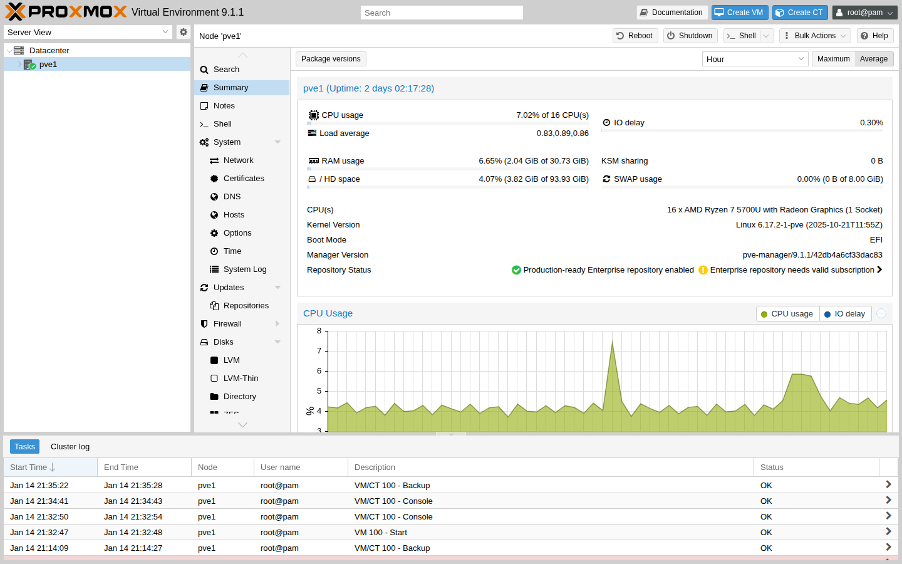

# 第3章　Proxmox VE のインストール

## 章のゴール

この章では、読者が Proxmox VE を 1 台インストールし、初期設定と Web UI へのアクセスまでを完了できるようになることを目標とします。
インストールの流れと、よくあるつまずきポイントを俯瞰しつつ、後続章で扱うクラスタ構成や運用に備えた最低限の前提を整えます。

## この章で分かること / 分からないこと

- 分かること:
  - インストール作業の全体像（どこで何を決めるか）
  - 初回ログインまでの確認ポイント（成功判定）
  - つまずきやすい箇所の切り分け
- 分からないこと（後続章で扱います）:
  - VM の作成・ゲスト OS インストール（第4章）
  - ストレージ方式の詳細選定（第5章）
  - ネットワーク設計の詳細（第6章）

## 用語メモ（最小）

- ノード: Proxmox VE をインストールするサーバ（物理サーバ、またはネスト構成の Proxmox VE 用 VM）
- realm: ログイン時に「どの認証方式で認証するか」を表す区分（Web UI ではプルダウンで選ぶ）
- `root@pam`: 初期状態で用意される管理者ユーザー（`root`）を `pam`（Linux PAM）でログインする指定
- `Datacenter`: Web UI のツリー（Server View）の最上位。ノードやストレージなどをまとめて管理する入口
- `Summary`: ノードの概要（状態やバージョン等）を見るタブ/画面。まず最初の成功判定に使う

## 対象読者と前提

この章は、既に仮想化の基本概念を理解しており、Part 0 で紹介したラボ環境を用意できている読者を想定しています。
具体的には次のような前提を置きます。

- 本章の画面・操作例は Proxmox VE 9.1（9.x 系）を前提としていること
- Proxmox VE をインストールするための物理サーバまたはネスト用の仮想マシン（将来的に Proxmox VE ノードとして利用するもの）を 1 台以上用意できること
- インストール対象ノードに対してコンソール接続（ディスプレイ／キーボード、もしくはリモートコンソール）が可能であること
- 基本的な BIOS/UEFI 設定の変更手順を把握していること

## インストール前の準備

インストール作業に入る前に、次の項目を確認しておきます。

- CPU の仮想化支援機能（Intel VT-x / AMD-V）が有効になっているか
- ブートモード（BIOS / UEFI）とブート順の設定
- Proxmox VE のインストール ISO イメージの入手と、USB メモリなどへの書き込み
- ネットワーク接続と IP アドレス割り当て方針（固定 IP を推奨）

これらの準備が整っていると、インストーラの画面遷移をスムーズに進めることができます。

### インストールメディア（ISO/USB）の準備

Proxmox VE のインストーラは ISO イメージとして提供されます。
まずは公式のダウンロードページから、対象バージョン（本書では 9.1 / 9.x）に対応する ISO を入手してください（例: `https://pve.proxmox.com/wiki/Downloads`）。

可能であれば、ダウンロード後にチェックサム（SHA256 など）を確認し、ファイル破損がないことを確認してから USB メモリへ書き込みます。

USB メモリへの書き込みは、利用している OS によって手順が変わります。たとえば Linux では `dd` で書き込む方法があります。

注意:

- USB 書き込みは **対象デバイスを間違えるとデータを消します**。デバイス名（例: `/dev/sdX`）は慎重に確認してください。
- ISO をどのツールで書き込むかによって、UEFI/BIOS の扱いが変わることがあります。起動できない場合は、USB の作り方とブートモード（UEFI/Legacy）の組み合わせを疑って切り分けてください。

補足: Proxmox VE 9.x では、カーネルや systemd の更新に伴ってネットワークインターフェース名が変わることがあります。
複数 NIC 構成や本番想定の構成では、必要に応じて `pve-network-interface-pinning` を使ってインターフェース名を固定することも検討ポイントになります。

### インストール前に決めること（入力値の例）

インストーラでは、後から変えにくい値（ホスト名、IP アドレス、インストール先ディスクなど）を入力します。
迷う場合は、まず次のような「学習用の固定値」を決めてから進めると手戻りが減ります。

- ノード名（ホスト名）: 例 `pve1`
- 管理用 IP: 例 `192.168.10.11/24`
- デフォルトゲートウェイ: 例 `192.168.10.1`
- DNS: 例 `192.168.10.1`（家庭用ルータ等）または組織の DNS
- タイムゾーン: 例 `Asia/Tokyo`

注意: インストール先ディスクの選択は取り返しがつきません。学習用の専用ディスクを使い、重要なデータが入ったディスクは選ばないでください。

## インストーラの画面遷移と入力項目

Proxmox VE のインストールメディアから起動すると、グラフィカルなインストーラが立ち上がります。典型的な画面の流れは次のようになります。

1. ライセンス確認
2. インストール先ディスクの選択とファイルシステムの設定
3. ロケール・タイムゾーン・キーボードレイアウトの設定
4. 管理者パスワードとメールアドレスの入力
5. ホスト名と初期ネットワーク設定の入力

各画面では、画面下部に表示されるエラーメッセージや注意書きを確認しながら進めます。
特に、インストール先ディスクの選択とネットワーク設定は、後から変更する際の影響が大きいため慎重に選択してください。

インストール全体の流れは次の図で俯瞰します。
実際の画面とは細部が異なる場合がありますが、「どのタイミングで何を入力するか」と「完了後にどこへアクセスするか」を把握する助けになります。


## 初期 Web UI アクセスと最低限の確認

インストール完了後、再起動すると Proxmox VE ノードが起動し、コンソールには Web UI へのアクセス URL が表示されます。
同じネットワーク上のクライアント端末からブラウザを開き、その URL にアクセスしてログインできることを確認します。

補足:
- URL は `https://<IPアドレス>:8006/` の形式になることが一般的ですが、まずは **コンソールに表示された URL** をそのまま使ってください。
- 初回アクセスでは証明書警告が表示されることがあります（学習環境では一般的）。本番環境では証明書の扱いを運用方針として決める必要があります。

ログイン画面の例:


### 初回ログイン（ユーザー名と認証方式）

Proxmox VE では、ユーザー名に認証方式（realm）を含めて指定します。
画面上で realm を選択する場合もありますが、まずは次の形を覚えておくと迷いにくくなります。

- 初回ログインのユーザー名: `root@pam`
- パスワード: インストール時に設定した管理者パスワード

補足:
- realm を省略して `root` だけを入力すると、ログインに失敗することがあります。
- インストール時に入力したメールアドレスは、`root@pam` 宛の通知（更新やバックアップ通知など）に利用されます。

#### 入口（Web UI でどこを開くか）

ログイン後に「次にどこを押せばよいか分からない」状態になりやすいので、まずは次の 2 点だけ押さえてください。

1. 左のツリー（Server View）で `Datacenter` を展開し、対象ノード（例: `pve1`）をクリックする
2. 左のナビ（メニュー）で `Summary` を開く

補足:

- ラボ環境では、ログイン直後に “No valid subscription” のような通知が表示されることがあります。内容を確認したうえで閉じて進めてください（本番はサブスクリプション/リポジトリ方針を決めます。第9章で扱います）。

初回ログイン時には、次のような点を確認しておくとよいでしょう。

- ノード名や IP アドレスが想定どおりに設定されているか
- ストレージタブに、インストール時に選択したストレージが正しく表示されているか
- 時刻設定が大きくずれていないか（必要に応じて NTP 設定を行う）

ここまで確認できれば、このノードは「第4章の VM 作成」に進める状態になっています。

ログイン後の画面の例（Datacenter の Summary 画面）:



### スクショ無しでの最小確認（CLI）

スクリーンショットが無い段階でも、次の CLI で「インストール直後に最低限見るべきポイント」を確認できます。

```bash
pveversion -v
ip -br a
ip r
ss -lntp | grep ':8006'
```

出力例（抜粋）:

```text
$ pveversion -v
pve-manager/9.1.1/<build>
proxmox-kernel-6.17.2-1-pve
...

$ ip -br a
lo               UNKNOWN        127.0.0.1/8 ::1/128
eno1             UP
vmbr0            UP             192.168.10.11/24
...

$ ss -lntp | grep ':8006'
LISTEN 0 4096 0.0.0.0:8006 0.0.0.0:* users:(("pveproxy",pid=...,fd=...))
```

見るポイント（最低限）:

- `pveversion -v`: `pve-manager/9.1.x` が表示される（9.x 系であることを確認）
- `ip -br a` / `ip r`: 管理用 IP とデフォルトゲートウェイが想定どおりである
- `ss -lntp | grep ':8006'`: `:8006` が LISTEN している（Web UI の待受）

## よくあるつまずきポイント

インストール時に遭遇しやすい問題として、次のようなものがあります。

- 起動順の設定ミスにより、インストールメディアからブートできない
- UEFI / Legacy BIOS の設定とインストールメディアの作成方法が一致していない
- ネットワーク設定の誤りにより、インストール後に Web UI にアクセスできない
- 初回ログインで弾かれる（ユーザー名/realm の指定ミス）

これらの問題を避けるためには、事前にラボ環境の設計と前提条件を整理しておくことが重要です。
詳細なトラブルシュートやクラスタ構成に関わる注意点は、後続の章で改めて扱います。

アクセスできないときの最小切り分け（例）:

- 管理用 PC から、コンソールに表示された IP へ疎通できるか（同一セグメント、VLAN、配線）
- ブラウザで `https://<IP>:8006/` を開けるか（ポート番号の付け忘れに注意）
- ノードのコンソールで、IP アドレスが想定どおりか（入力ミスや DHCP になっていないか）
- ノードのコンソールで、8006 が待ち受けているか（例: `ss -lntp | grep ':8006'`）
- ログインできない場合は、まず `root@pam` を試す（realm を省略しない）

## まとめ

- インストール時に後から変えにくい値（ディスク、ホスト名、IP など）を事前に決めてから進めると手戻りを減らせます。
- 成功判定は「Web UI にログインでき、最低限の設定（時刻・ストレージなど）が想定どおりである」ことです。
- アクセスできない場合は、ネットワーク到達性と `:8006`、ノード側の IP 設定を最小手順で切り分けます。
- 次に読む章: 第4章「仮想マシンの作成と基本操作」に進み、VM を 1 台作って動かします。
