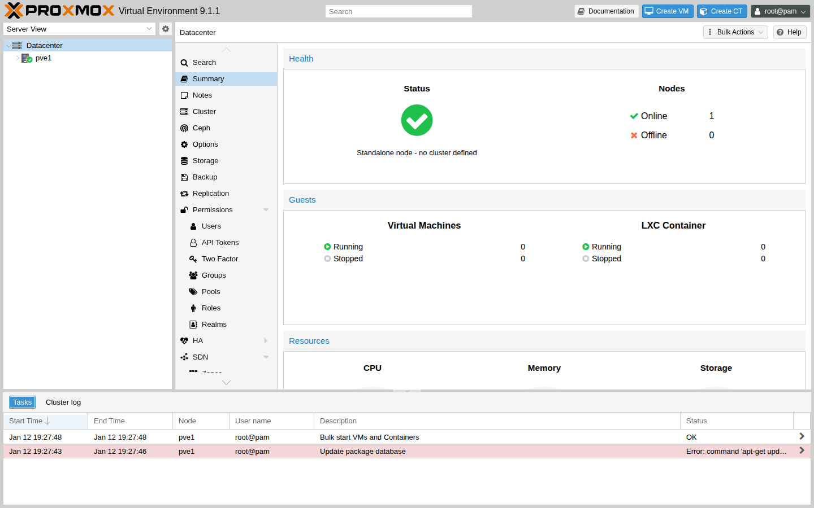
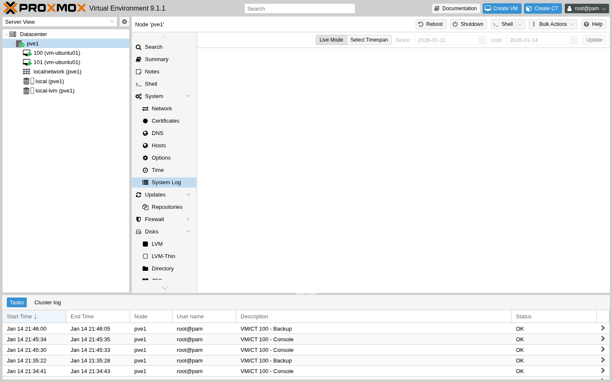

# 第9章　運用・監視・トラブルシュート

## 章のゴール

本章では、Proxmox VE 環境を日常的に運用するうえでの基本的なタスクと、
監視・ログ確認・トラブルシュートの入り口となる考え方を整理します。

## この章で分かること / 分からないこと

- 分かること:
  - 日次/週次/月次でやると良い “最低限の運用”
  - まず何を見て、何を切り分けるか（トラブルシュートの入口）
- 分からないこと（別パスで扱います）:
  - 特定の監視製品（Prometheus など）に依存した詳細設計
  - カーネル/ハードウェア故障の深いデバッグ（環境差が大きい）

## 用語メモ（最小）

- タスク（Tasks）: Web UI で実行された操作の履歴（成功/失敗の入口になりやすい）
- System Log（Syslog）: ノードのログの入口（詳細はホスト OS のログも併用する）
- Runbook: 手順を標準化した運用メモ（「誰がやっても同じになる」ことが目的）

## 最初に見る場所（チェックリスト）

トラブル時にいきなり深掘りすると迷子になりがちです。まずは次の順で “入口” を確認します。

1. 何が起きたか（症状・影響範囲・発生時刻）をメモする
2. Web UI の `Tasks` / `System Log` で、直近の失敗タスクやエラーを確認する
3. ノード/ゲストの概要画面（リソースグラフ）で、CPU/メモリ/ディスク I/O の異常がないか見る
4. 必要に応じてホスト OS のログ（`journalctl` など）へ進む

図としての全体像は `diagrams/part4/ch9/triage-flow.svg` を参照してください。

Web UI 画面の例:

`Tasks`（タスク履歴）の例:

System Log（Syslog）の例:

ノード概要（リソースグラフ）の例:

## ログと基本的な指標の読み方（概要）

Proxmox VE の運用では、Web UI とホスト OS のログを往復しながら状況を把握します。
最初は「入口がどこか」だけ覚えておくと迷いにくくなります。

- Web UI の `Tasks`: 操作やジョブの実行結果（成功/失敗、エラーメッセージ）を確認する入口
- Web UI の `System Log`: ノード側のログを眺める入口（より詳しくは `journalctl` へ）
- ノード/ゲストの Summary（リソースグラフ）: いつから負荷や I/O が増えたかを俯瞰する入口

## 代表的なトラブルシュートシナリオ（入口）

ここでは「最初に何を見て、次にどちらへ進むか」だけを整理します。
削除や強制操作は、原因の見当がついてから行うほうが安全です。

### ケース 1: Web UI にアクセスできない / ログインできない

入口（切り分け）:

1. `https://<PVE_HOST>:8006/` に到達できるか（タイムアウト/拒否/証明書警告）
2. 同一ネットワークなら疎通確認（例: `ping <PVE_HOST>`） ※環境によっては ICMP が遮断されます
3. ノードのコンソールに入れるなら、Web UI 関連サービスの状態を確認する（例: `systemctl status pveproxy pvedaemon pve-cluster --no-pager`）

次にやること（目安）:

- 到達できない: まずネットワーク/名前解決/経路（ルータ・FW）側を疑う
- 到達できるがログインできない: 認証設定の変更や直近の設定変更を確認する（`Tasks` も併用）
- サービスが落ちている/エラーが出る: `journalctl -u pveproxy -n 50 --no-pager` などでエラーメッセージを確認する

### ケース 2: VM が起動しない / 起動直後に停止する

入口:

- 対象 VM の Web UI で `Tasks` を開き、「Start」失敗のエラーメッセージを確認する
- ノード側のリソース（メモリ不足/ディスク不足）や、ストレージ状態（`pvesm status`）を確認する
- ロック状態が見える場合は、まず「なぜロックが残ったか」を `Tasks` で確認する（安易に解除しない）

次にやること（目安）:

- リソース不足: 空き容量・メモリ余力を確保する（不要な ISO/バックアップの整理、他 VM の停止など）
- ストレージ異常: 対象ディスクがあるストレージの状態から切り分ける
- 設定変更直後: 直近の変更（CPU/メモリ/ディスク/ブリッジ）を最優先で疑う

### ケース 3: ストレージ警告（容量不足・I/O遅延）が出る

入口:

- どのストレージ（例: `local` / `local-lvm` / 追加ストレージ）に対する警告か確認する
- Web UI の Storage 画面、または CLI の `pvesm status` で使用率と状態を見る
- 直近のバックアップやスナップショットが増えていないか確認する（特に「一時的に増える」ことがある）

次にやること（目安）:

- 容量不足: まず「何が増えたか」を特定し、削除の前に影響範囲を確認する
- I/O 遅延: バックアップなど重いジョブの実行タイミングと重なっていないかを見る（`Tasks` が入口）

### （補足）ケース 4: バックアップジョブが失敗する

- `Tasks` のエラーを読み、原因が「到達性（ネットワーク）」「容量（ストレージ）」「対象 VM の状態」どれに近いかを切り分ける
- 詳細は第8章を参照してください

## 更新の基本（リポジトリとメンテナンス）

Proxmox VE は、パッケージ更新によって機能追加や不具合修正、カーネル更新が行われます。
そのため「更新の方針」と「更新できる前提（復旧手段）」を先に決めておくと、運用で詰まりにくくなります。

### リポジトリの前提（ざっくり）

- サブスクリプションがある環境では、エンタープライズ向けリポジトリ（例: `pve-enterprise`）を利用するのが基本です。
- ラボや検証では、コミュニティ向けリポジトリ（例: `pve-no-subscription`）を使うことがあります。

補足:
- リポジトリ設定ファイルは `/etc/apt/sources.list.d/` 配下に置かれます（例: `pve-enterprise.sources` など）。
- 本番環境では「どのリポジトリを使うか」を運用ポリシーとして明確にし、混在させないことが重要です。

### 更新前チェックリスト（例）

- 重要な VM のバックアップが取れており、復元手順も確認できている（「バックアップはあるが復元したことがない」が最も危険です）
- （可能なら）更新直前にスナップショットを取る ※スナップショットはバックアップの代わりになりません。ストレージによって可否/挙動が変わります
- どのリポジトリを使うか（Enterprise / No-Subscription）が運用方針どおりで、混在していない
- ノード再起動の影響を見積もれている（停止が必要か、クラスタなら退避が必要か）
- メンテナンス時間帯を確保している
- ノードのコンソールに入れる手段（リモートコンソール/物理）を確保している

### Web UI に入れないときの最小確認（CLI）

Web UI が使えない状況でも、次の CLI で「調査や更新に入る前の入口」を作れます。

- Proxmox VE のバージョン確認: `pveversion -v`
- リポジトリ設定ファイルの確認: `ls -1 /etc/apt/sources.list.d/`
- パッケージ一覧の更新（アップグレードはしない）: `apt update`
- 直近のエラーログ（入口）: `journalctl -p err..alert -n 50 --no-pager`

## 日常運用チェックリスト（例）

### 日次

- バックアップジョブの結果確認（失敗があれば理由をメモする）
- 重要な VM / コンテナの稼働状況確認
- リソース使用率（CPU / メモリ / ストレージ）の簡易チェック

### 週次

- ストレージ使用量の推移確認と将来予測のメモ
- クラスタ状態（ノードの状態、クォーラム）の確認
- 監視システムのアラート履歴レビュー

### 月次

- バックアップ・リストア手順のリハーサル
- 更新適用の検討（リリースノートと既知の問題を確認し、必要ならメンテナンス計画を立てる）
- 運用ドキュメントや Runbook の見直し

## 障害時の最初の5分（Runbook のたたき台）

「何から見ればよいか分からない」状態を避けるために、最初の 5 分は次の順で “入口” を確認します。
ここでは、危険性の低い確認系コマンドだけを扱います。

1. 症状をメモする（いつから/何が/誰が困っているか）
2. 直近の失敗タスクを確認する（Web UI の `Tasks`、Web UI が使えないなら `pvesh get /cluster/tasks --limit 20`）
3. ノードのエラーログを確認する（Web UI の `System Log`、CLI なら `journalctl -p err..alert -n 50 --no-pager`）
4. リソース枯渇を疑う（CPU/メモリ/ディスク）
   - ノード概要（グラフ）を確認する
   - CLI 例: `uptime` / `free -h` / `df -h` / `pvesm status`
5. クラスタ環境の場合はクォーラムとノード状態を確認する（`pvecm status` / `pvecm nodes`）

補足:

- ネットワークやストレージを変更した直後に障害が出た場合は、「直近の変更」を最優先で疑うと切り分けが速くなります。
- “復旧を急ぐ” あまり、削除や強制操作を最初の 5 分で実行しないことを推奨します（状況の悪化を避けるため）。

## まとめ

- 日次/週次/月次のチェックリストを用意し、「平常時の状態」を把握できるようにします。
- 障害対応では、Web UI の履歴/ログとホスト OS のログ、メトリクスを組み合わせて状況を切り分けます。
- トラブルシュートは「いつから」「何が変わったか」「どのコンポーネントか」を意識して進めると、再現と復旧がしやすくなります。
- 次に読む章: 第10章「エンタープライズ連携・事例ベースの設計指針」で、本番導入で論点になりやすい連携を整理します。
