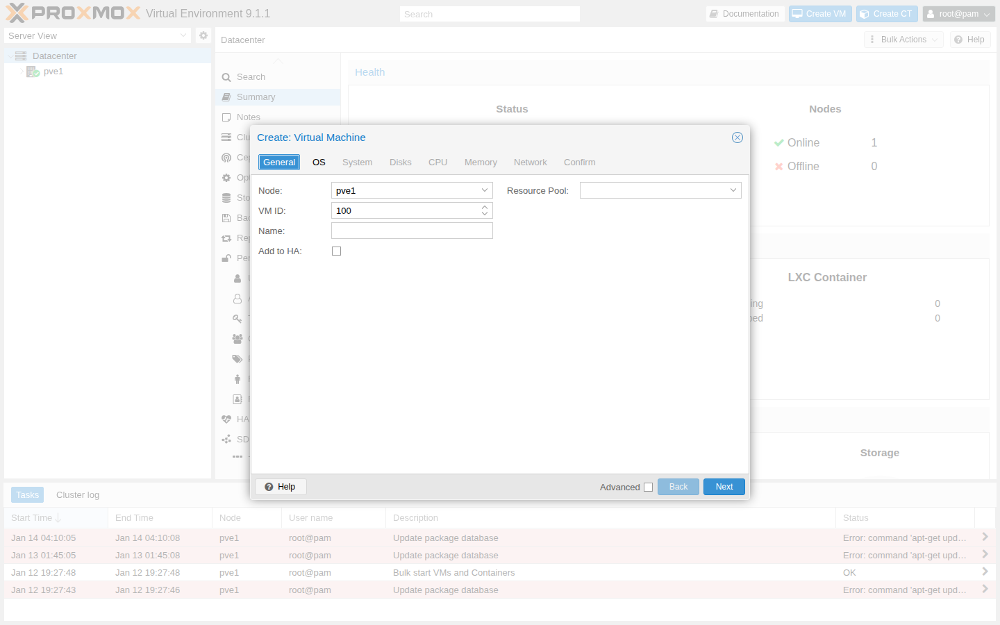
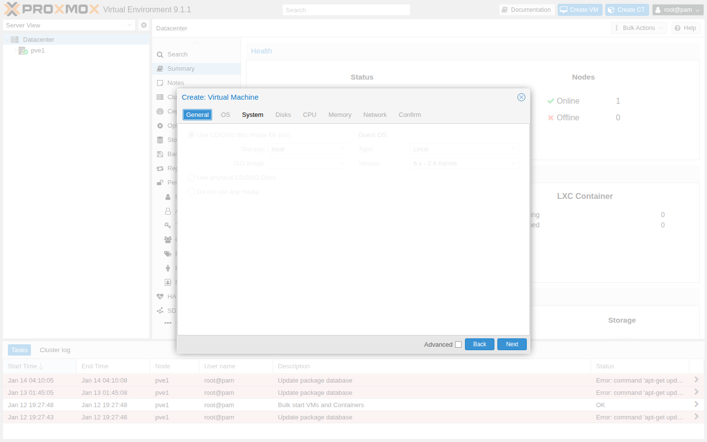
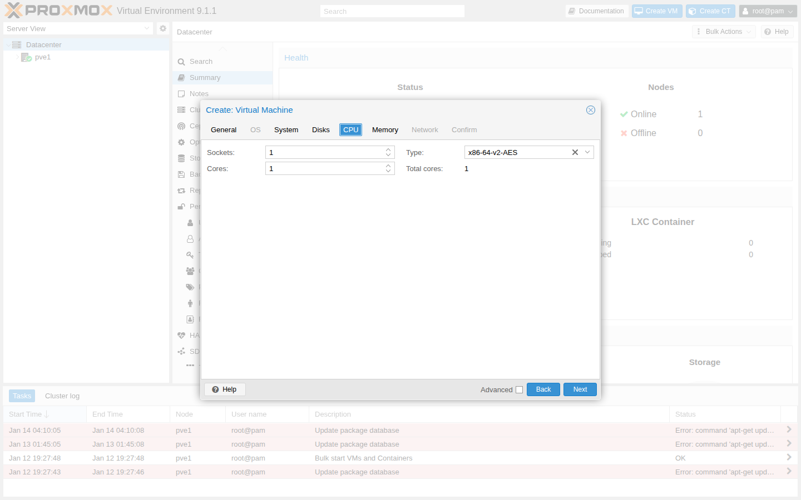
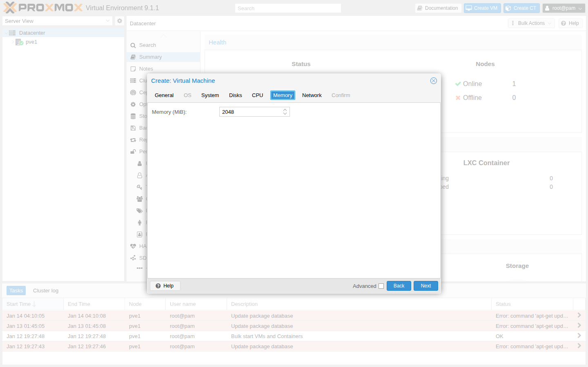

# 第4章　仮想マシンの作成と基本操作

## 章のゴール

この章では、Proxmox VE 上で仮想マシンを作成し、起動・停止・コンソール接続・スナップショット取得といった基本操作を一通り体験できるようになることを目標とします。
本章の画面・操作例は Proxmox VE 9.1（9.x 系）を前提とします。

## この章で分かること / 分からないこと

- 分かること:
  - VM 作成ウィザードで「どこを何のために設定するか」
  - VM の起動・停止・コンソール接続などの基本操作
  - スナップショット/テンプレートの使いどころ（概念と注意点）
- 分からないこと（後続章で扱います）:
  - ストレージ方式ごとの最適化（第5章）
  - ネットワーク/VLAN の詳細設計（第6章）
  - クラスタ/HA と組み合わせた運用（第7章以降）

## 想定するゲスト OS

本書では、例として一般的な Linux ディストリビューション（例: Debian 系や Ubuntu Server）をゲスト OS として利用します。
ISO イメージの取得方法やライセンスは各ディストリビューションの公式ドキュメントに従ってください。

## 事前準備（チェックリスト）

第3章のインストールが完了し、Web UI にログインできる状態を前提とします。加えて、次の項目を確認しておくとスムーズです。

- ISO イメージが用意できている（この章で Proxmox のストレージにアップロードする）
- VM を置くストレージに空きがある（ディスク容量に余裕がある）
- ノードのネットワーク（ブリッジ）が構成済みである（典型的には `vmbr0`）

## ISO イメージをアップロードする（Web UI）

ゲスト OS のインストールに使う ISO は、Proxmox VE から参照できるストレージに置いておく必要があります。
ここでは、Web UI から ISO をアップロードして「VM 作成ウィザードで選べる状態」にする流れを確認します。

典型的な手順（例）:

1. 左のツリー（Server View）で対象ノードをクリックする
2. 左のナビで `local`（または ISO を置くストレージ）をクリックする
3. 画面上部の `Content` タブを開く
4. `Upload` をクリックし、ISO ファイルを選んでアップロードする
5. `Content` の一覧に ISO が表示されることを確認する

補足:

- インストール直後は `local` と `local-lvm` のようなストレージが作られていることが多いですが、インストール時のディスク構成（ZFS を選んだ等）によって名前や構成は変わります。
- `Upload` が見当たらない場合は、そのストレージが ISO を扱えない設定（コンテンツ種別）になっている可能性があります。
  - 例: `local` は “ISO image” を扱えるが、`local-lvm` は “Disk image” 専用、といった分担になっていることがあります（環境差あり）。

## 仮想マシン作成ウィザード

Web UI から「仮想マシンの作成」ウィザードを起動し、次のような項目を順に設定します。

- 一般設定（VM ID、名前）
- OS タブ（ゲスト OS タイプ、インストールメディアとしての ISO イメージ）
- システム設定（BIOS タイプ、マシンタイプなど、基本的にはデフォルトで問題ない）
- ディスク設定（ディスクサイズ、バス種別、ストレージの選択）
- CPU 設定（ソケット数・コア数）
- メモリ設定（割り当てメモリ量）
- ネットワーク設定（ブリッジ、モデル）

流れの全体像は `diagrams/part1/ch4/vm-create-flow.svg` にまとめます。

スクリーンショット（例: Create VM wizard）:

- General（一般設定）
  - 
- OS
  - 
- System
  - 
- Disks
  - 
- CPU
  - 
- Memory
  - 
- Network
  - 

### 手順（Web UI）

1. 画面右上の `Create VM` をクリックする
2. `General` タブで VM の `Name` を入力する（例: `vm-ubuntu01`）
3. `OS` タブで、インストールメディアとしてアップロード済みの ISO を選ぶ
4. `System` / `Disks` / `CPU` / `Memory` / `Network` を順に設定する（迷う場合は次の「学習用の最小構成」をベースにする）
5. `Confirm`（確認）画面で内容を確認し、`Finish` で作成する

補足:

- メニュー名やタブ名はバージョン差で変わることがあります。その場合でも「右上の VM 作成ボタン」「General/OS/Disks/Network の流れ」を目印に探してください。
- ISO が選べない場合は、前節の「ISO が `Content` に表示されているか」「ISO を扱えるストレージに置いているか」を先に確認します。

### 設定値の例（学習用の最小構成）

迷ったときは、まず「学習用の最小構成」として次のような値から始めるとよいでしょう（必要に応じて調整します）。

| 項目 | 例 | 補足 |
| --- | --- | --- |
| 名前 | `vm-ubuntu01` | 役割が分かる名前にする |
| vCPU | 2 | まずは小さく |
| メモリ | 2–4 GB | GUI なしのサーバ用途なら 2 GB から |
| ディスク | 20–40 GB | 後から拡張できることが多い |
| ネットワーク | `vmbr0` | 最初は管理ネットワークと共用でよい |

各ステップの詳細な画面（スクリーンショット）は、後日 `images/part1/ch4/` に追加する予定です。
現時点では、ウィザードの各タブで「何を」「何のために」設定するかと、次節の成功判定を手がかりに進めてください。

## 基本的な起動・停止・コンソール操作

仮想マシンを作成したら、次の操作を試してみます。

- 起動 / シャットダウン / 再起動
- コンソールへの接続（Web ブラウザ経由のコンソールビューア）
- ISO からのブートと OS インストールの開始

これらの操作は、VM 一覧から対象の仮想マシンを選択し、上部メニューのボタンやコンテキストメニューから行います。

### ハンズオン（最小）: ゲスト OS のインストール → 初回ログイン → 疎通確認

ここでは、Proxmox VE 側の操作に集中しつつ、「VM が使える状態」まで到達する最小の流れを確認します。
ゲスト OS 側の詳細なインストール手順（画面のクリック）は、ディストリビューションごとに異なるため本書では踏み込みません。

1. VM を起動し、`Console` を開いて ISO から起動していることを確認する
2. ゲスト OS のインストールを完了し、再起動後にログインできることを確認する
3. ゲスト OS からネットワーク疎通を確認する（例: `ip -br a` / `ip r` / `ping -c 3 <ゲートウェイ>`）

補足:

- 疎通確認は、まず「ゲートウェイまで到達できるか」を確認し、その後に外部（インターネットや別サーバ）へ進むと切り分けしやすくなります。
- 疎通できない場合は、VM のブリッジ設定（例: `vmbr0`）と、ノード側のブリッジ状態（第6章）から確認してください。

成功判定（最低限）:

- VM を起動できる（エラーで止まらない）
- コンソールに接続でき、ISO からのブート画面（または OS インストーラ）が表示される
- ゲスト OS のインストール後、ゲスト側でネットワーク疎通が取れる（ping など）

### スクショ無しでの最小確認（CLI）

スクリーンショットが無い段階でも、次の CLI で「ISO が見える」「VM が存在する/起動している」を最低限確認できます。

ISO の確認（例: `local` に置いた場合）:

```bash
pvesm list local --content iso
```

出力例（抜粋）:

```text
$ pvesm list local --content iso
Volid                                     Format  Type  Size
local:iso/ubuntu-24.04.1-live-server-amd64.iso iso     iso   <SIZE>
...
```

VM の確認:

```bash
qm list
qm status <VMID>
```

出力例（抜粋）:

```text
$ qm list
 VMID NAME        STATUS     MEM(MB) BOOTDISK(GB) PID
  100 vm-ubuntu01 running    2048    20.00        12345

$ qm status 100
status: running
```

見るポイント（最低限）:

- `pvesm list ... --content iso`: アップロードした ISO が表示される
- `qm list`: 期待した名前の VM が表示される（`VMID` は以降の操作で使います）
- `qm status <VMID>`: `running` / `stopped` が表示される

## スナップショットとテンプレートの基礎

ゲスト OS のインストールや初期設定が完了したら、その状態をスナップショットとして保存しておくと便利です。
また、ベースとなる仮想マシンをテンプレート化し、同様の構成の VM を複数作成することもできます。

- スナップショット: 現在のディスク・メモリ状態を保存し、必要に応じてロールバックできる
- テンプレート: ベースイメージから新しい VM をすばやく複数作成する際に利用する

本書では、詳細なテンプレート運用や自動化は後続の章で扱い、ここでは「どのような場面で使うのか」をイメージできる程度に留めます。

### スナップショットを取るタイミング（例）

ラボでは「作り直せること」が最優先ですが、スナップショットを使うと学習の試行錯誤を速くできます。
たとえば次のタイミングで取ると便利です。

- OS インストール直後（例: `baseline-installed`）
- 重要な設定変更の直前（例: `before-network-change`）

Web UI の例（入口）:

1. 対象 VM を選ぶ
2. `Snapshots` を開く
3. `Take Snapshot` で名前を付けて作成する

### テンプレート化の流れ（例）

同じ構成の VM を複数作りたい場合は、1 台を “ひな型” としてテンプレート化し、そこからクローンするのが楽です。

1. ひな型となる VM をシャットダウンする
2. VM のメニューから `Convert to template`（または同等の操作）を実行する
3. テンプレートから `Clone` を作成し、新しい VM を起動する

補足:

- クローン（特に “Linked Clone”）はストレージ側の前提（スナップショット/クローン機能）が必要になります。うまくいかない場合は、まず “Full Clone” で試してください（環境差あり）。

注意:

- スナップショットは「バックアップの代わり」ではありません。バックアップは第8章で扱います。
- ストレージの種類によってはスナップショットの扱い（可否/方式/容量影響）が異なります（第5章）。

## よくあるつまずきポイント

仮想マシンの作成や起動時に遭遇しやすい問題として、次のようなものがあります。

- 割り当てメモリやディスク容量が不足しており、ゲスト OS のインストールに失敗する
- ネットワークブリッジの設定ミスにより、ゲスト OS から外部ネットワークに接続できない
- ISO イメージの選択を忘れ、何もブートできない状態になる
- ISO が選べない（アップロード先/コンテンツ種別のミス）

これらの問題に気づいた場合は、VM の設定を見直すか、一度削除して再作成することをためらう必要はありません。
ラボ環境では、「作り直せる状態を保つ」ことが重要です。

切り分けの入口（例）:

- ISO が選べない:
  - `local` の `Content` に ISO が表示されているか（Web UI）
  - CLI なら `pvesm list local --content iso` で見えるか
- VM が起動しない/止まる:
  - Web UI の `Tasks` で対象 VM の直近タスクを確認する
  - CLI なら `qm status <VMID>` / `qm list` で状態を確認する
- ゲスト OS のネットワーク疎通が取れない:
  - VM の `Hardware` で NIC の Bridge が想定どおりか（例: `vmbr0`）
  - ノード側でブリッジが存在するか（第6章、CLI なら `ip -br a` / `bridge link`）

## まとめ

- VM 作成ウィザードでは「名前/CPU/メモリ/ディスク/ネットワーク（ブリッジ）」の意味を理解して設定します。
- 最低限の成功判定は「VM が起動し、コンソールに接続でき、ゲスト OS で疎通できる」ことです。
- スナップショットは便利ですがバックアップの代替ではありません（バックアップは第8章）。
- 次に読む章: 第5章・第6章で、ストレージとネットワークの設計の考え方を整理します。
