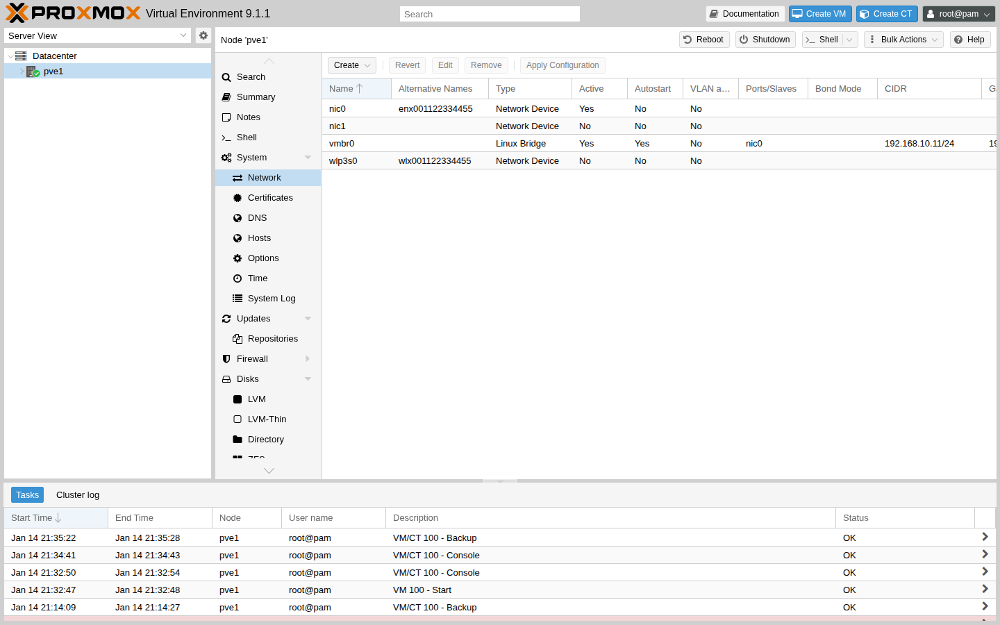

# 第6章　ネットワーク設計と VLAN

## 章のゴール

本章では、Proxmox VE でよく利用されるネットワーク構成（Linux ブリッジ、ボンディング、VLAN）の考え方を整理し、
単一ノードおよび小規模クラスタのラボ環境で再現しやすいパターンを身につけることを目標とします。
本章の画面・操作例は Proxmox VE 9.1（9.x 系）を前提とします。

## この章で分かること / 分からないこと

- 分かること:
  - Linux ブリッジ/ボンディング/VLAN の役割と、ラボでの組み合わせ方
  - 単一ノード/3 ノードクラスタでの「迷いにくい」ネットワーク分け
- 分からないこと（後続章または別パスで扱います）:
  - UI の画面操作を 1 クリックずつ追う手順（スクリーンショット取得後に追加）
  - SDN/EVPN などの発展トピック（本書では優先度低）

## 最初に決めること（チェックリスト）

ネットワークは後から変更すると影響範囲が大きいので、ラボでも最初に方針を決めておくと手戻りが減ります。

- 管理ネットワーク（ノードの Web UI に入るための経路）をどれにするか
- VM 用ネットワークを分けるか（最初は共用で開始し、必要なら VLAN で分離）
- ストレージ/バックアップ用ネットワークを分けるか（Ceph を使うなら検討）
- VLAN を使う場合: VLAN ID と用途の対応（例: 10=管理、20=VM、30=ストレージ）

例（学習用のシンプルな割り当て）:

- VLAN 10（管理）: `192.168.10.0/24`
- VLAN 20（VM）: `192.168.20.0/24`
- VLAN 30（ストレージ/バックアップ）: `192.168.30.0/24`（必要な場合のみ）

## 用語メモ（最小）

- ブリッジ: VM/コンテナを物理 NIC に「つなぐ」ための仮想スイッチ
- ボンド: 複数 NIC を束ねて冗長化/帯域確保する仕組み
- VLAN: 1 本のリンクを論理的に分割する仕組み（スイッチ側と整合が必要）

## ラボ環境で想定するネットワークパターン

Part 0 で紹介したラボパターンに合わせて、シンプルなネットワーク構成を想定します。

### パターン A（単一ノードラボ）

- 1 本の物理 NIC を Linux ブリッジ（例: vmbr0）として利用し、その上に VM の仮想 NIC を接続する
- 必要に応じて、管理用ネットワークとゲスト用ネットワークを VLAN で分離する

### パターン B（3 ノードクラスタラボ）

- 各ノードで、管理用と VM／ストレージ用のネットワークを分ける前提でブリッジを構成する
- クラスタ通信や Ceph 用トラフィックを流すネットワークは、可能であれば物理的または VLAN で分離する

これらの関係は、`diagrams/part2/ch6/network-topology.svg` に概略図として示します。

## Linux ブリッジの基本

Proxmox VE では、Linux ブリッジを用いて仮想マシンやコンテナを物理ネットワークに接続します。
標準インストール直後は、物理 NIC（例: eno1）に対して vmbr0 が作成され、そのブリッジにホスト自身と仮想マシンが接続される構成が一般的です。

Node -> Network 一覧の例:

## ネットワーク変更の反映と安全策（重要）

ネットワーク設定を変更して適用すると、ノードにアクセスできなくなるリスクがあります。
特に本番環境では、適用前に必ず「コンソールに入れる手段（物理/リモートコンソール）」を確保してください。

補足（挙動のイメージ）:

- Proxmox VE のネットワーク設定は `/etc/network/interfaces` に反映されます。
- Web UI で設定を変更した場合、いきなり `/etc/network/interfaces` を書き換えるのではなく、まず `/etc/network/interfaces.new` に変更内容が書かれます。
- その後、Web UI の `Apply Configuration`（または同等のボタン）で設定を反映します。

手動で `/etc/network/interfaces` を編集した場合は、`ifupdown2` が利用できる環境では `ifreload -a` で反映できます。
ただし、適用に失敗すると復旧作業が必要になるため、ラボでも「いつでも戻せる」前提（スナップショットやコンソール確保）で試してください。

### 反映後の最小確認（CLI）

スクリーンショットが無い段階でも、最低限次の確認ができると「今どこで詰まっているか」を切り分けやすくなります。
可能なら、反映直後はいったんノードのコンソールで確認してください（遠隔からの接続が切れていると切り分けが難しくなるためです）。

- IP アドレスの状態: `ip -br a`
- ルーティング（デフォルトゲートウェイ等）: `ip r`
- ブリッジの紐づき: `bridge link`
- VLAN を使っている場合: `bridge vlan show`

復旧の入口（最小）:

- 適用前に設定を退避: `cp -a /etc/network/interfaces /etc/network/interfaces.bak`
- 反映後にアクセス不能になった場合は、コンソールから退避ファイルへ戻して `ifreload -a` で反映する

### よくあるつまずきポイント（ネットワーク変更）

- `Apply Configuration` を押した後に Web UI へ入れなくなった:
  - まずはコンソールで IP 状態とルーティングを確認します（`ip -br a` / `ip r`）。
  - 変更前に退避した設定へ戻し、`ifreload -a` で反映して復旧できる状態を作ります。
- 変更が反映されない/意図と違う:
  - Web UI 変更直後は `/etc/network/interfaces.new` 側に書かれていることがあります。適用済みかどうかを意識します。

## ボンディングの概要

冗長性や帯域確保が必要な場合、複数の物理 NIC をボンドインターフェースとして束ね、その上にブリッジを構成することができます。
ラボ環境では、実際にリンク障害を再現してみることで、フェイルオーバの動作を確認できます。

## VLAN の基本と Proxmox VE での扱い

VLAN を利用すると、1 本の物理リンク上で論理的にネットワークを分離できます。
Proxmox VE では、ブリッジインターフェース上に VLAN タグ付きのサブインターフェースを作成し、
VM の仮想 NIC に VLAN ID を割り当てることで、複数の VLAN を使い分けることができます。

ラボ環境では、次のような使い分けが考えられます。

- VLAN 10: 管理用ネットワーク
- VLAN 20: ゲスト VM 用ネットワーク
- VLAN 30: ストレージ／バックアップ用ネットワーク（必要に応じて）

これらの設定は、Proxmox VE の Web UI またはテキスト形式の設定ファイルを通じて行います。
本書では、具体的な CLI コマンドや設定ファイルの例は後続の詳細セクションまたは付録で扱う前提とし、ここでは設計の考え方とパターンに焦点を当てます。

## 設計時の注意点

- 単一障害点を避ける（管理用ネットワークやストレージトラフィックが 1 本のリンクに集中しないようにする）
- VLAN 設定はスイッチ側とホスト側で整合性を取る
- ラボ環境では、複雑な構成を無理に再現するのではなく、目的に合った最小限のパターンで検証する

本章で整理したネットワークパターンは、後続のクラスタ・Ceph・バックアップの章で利用される前提となります。

## まとめ

- ラボでも、管理/VM/ストレージ（必要なら）といったネットワークの分け方を先に決めると手戻りを減らせます。
- Proxmox VE では Linux ブリッジを基本に、必要に応じてボンディングや VLAN を組み合わせます。
- VLAN はスイッチ側設定との整合が前提です。まずはシンプルなパターンで検証し、目的に応じて分離を進めます。
- 次に読む章: 第7章「クラスタ構成と HA」で、複数ノードの前提と流れを扱います。
